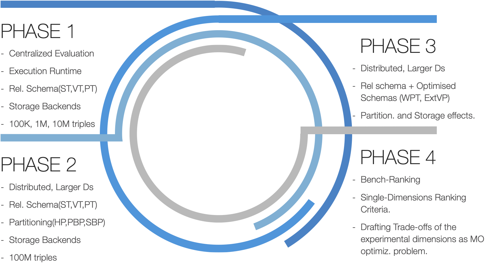

# SPARKSQL RDF Benchmarking
In this Project, we present a systematic comparison of there relevant RDF relational schemas, i.e., Single Statement Table, Property Tables or Vertically-Partitioned Tables queried using Apache Spark.

We evaluate the performance Spark SQL querying engine for processing SPARQL queries using three different storage back-ends, namely, Postgres SQL, Hive, and HDFS. For the latter one, we compare four different data formats (CSV, ORC, Avro, and Parquet).
We drove our experiment using a representative query workloads from the SP2Bench benchmark scenario.

The results of our experiments show many interesting insights about the impact of the relational encoding scheme, storage backends and storage formats on the performance of the query execution process.

- You can Visist the [Project webpage](https://datasystemsgrouput.github.io/SPARKSQLRDFBenchmarking/) for more details about the datasets, benchmark, installation, preprocessing , and experiments results.

### Project Phases
-----

 

#### Phase#1
In the frst phase of our work, we presented a systematic analysis of the performance of Spark-SQL query engine (mainly
the execution time) for answering SPARQL queries over RDF repositories on a centralized single-machine. In particular, we have
performed our experiments considering: (i) alternative relational schemas for RDF, i.e., Single Statement Tables, Vertical Tables, and Property Tables; (ii) various storage backends, i.e., PostgreSQL, Hive, and HDFS, and (iii) and different data formats (e.g. CSV, Avro, Parquet, ORC). We conducted experiments on RDF datasets with (100K, 1M, and 10M) triples.

#### Phase#2
In the second phase of our project, we conducted the same settings and configurations but differently in a distributed deployments with partitioning the data. In particular, we conducted our experiments in a Spark cluster of four machines. and we worked on a larger RDF dataset of 100M dataset. Notably, we don't use PostgreSQL anymore in this phase experiments.

#### Phase#3
In this phase also we conduct the phase#2 experimetns but with way larger datsets (100M, 500M, and 1B) triples. moreover, differently from the previous phase, we apply different ranking and combined ranking criteria to quantitively and effectively help practioners to choose the best configuration combinations in such complex solution space of different dimensions (schema, partitioning, and storage).

### Project Authors
 - [Mohamed Ragab](https://bigdata.cs.ut.ee/mohamed-ragab)
 - [Riccardo Tommasini](https://rictomm.me/)
 - [Sherif Sakr](http://kodu.ut.ee/~sakr/)
 - [Sadiq Eyvazov]() 

### Publications

    Mohamed Ragab, Riccardo Tommasini and Sherif Sakr, Benchmarking SparkSQL under Alliterative RDF Relational Storage Backends, QuWeDa@ISWC 2019.
