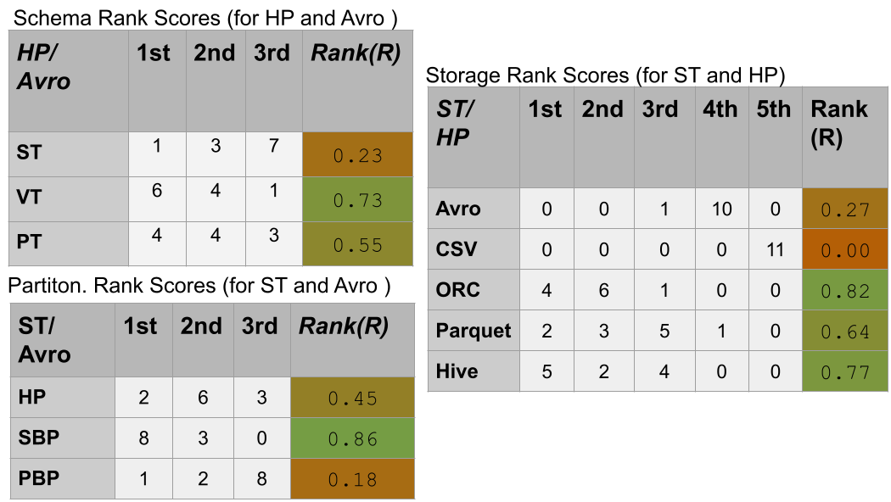
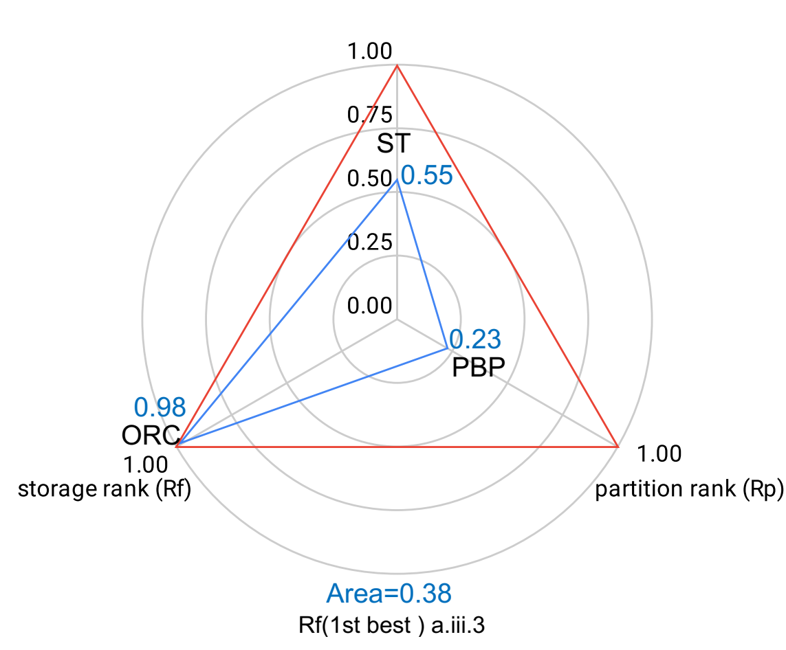
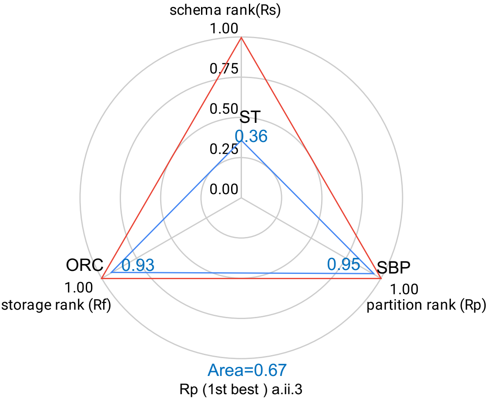

## Bench-Ranking: 

Leveraging Big Data (BD) processing frameworks like ApacheSpark-SQL to process large-scale RDF datasets holds a great interest inoptimizing  the  query  performance. 
Modern  BD  services  are  yet;  complicated  data  systems,  where  tuning  the  configurations  notably  affectsthe performance. 
Benchmarking different frameworks and configurationsprovides the community with best practices towards selecting the mostsuitable configurations. 
However, most of these benchmarking efforts areclassified  as  *descriptive*,  *diagnostic*,  or  *predictive*  analytics.  
There is still lack of **prescriptive** and **quantitative** analytics in benchmarking BD applications and systems. **Bench-ranking** takes the first steps in filling this timely research gap. 
In particular, we show the value of prescriptive ranking criteria for evaluating RDF processing systems based on Big Data frameworks.
We validated our proposals with a case-study on Apache Spark-SQL that includes several varying dimensions, i.e. three relational schemata, three partitioning techniques, and five storage backends. 
Selecting the best configuration combination out of this complex solution space is not an easy task. 
The proposed ranking criteria provide an accurate yet simple way that supports the practitioners in this task even in the existence of dimensions' trade-offs.

### Gartner's Analysis Framework:

Here, we reflect on the gap of performance analysis in existing works that use Big Data frameworks for RDF processing. 
In particular, we narrow down by discussing the problem of performance analysis alongside a well-known decision-making framework from **Gartner** shown below.

  

#### Descriptive analysis:
This level of analysis allows answering factual questions, e.g., *'what happened?'*. This kind of analysis extrapolates *fine-grain* observations that describe a phenomenon through different metrics that could capture its relevant dimensions. 
However, all the work to transform such observations into insights is a subject of the decision maker.

#### Diagnostic analysis:
This level reduces the amount of human intervention by combining the observed data with the *domain knowledge* and, thus, enabling answering explanatory questions like **'why it happened?'**. 
At this level, factual knowledge is contextualized to produce a diagnosis. Typically, diagnostic analysis requires an exploratory phase on existing data and data enrichment. 

#### Predictive analysis:
This level aims to forecast future results, and explain drivers of the observed phenomena using machine learning or data mining techniques. 

#### Prescriptive analysis:
This level reduces the need for human intervention even further by making the insight actionable. In practice, the prescriptive analysis relies on *statistical* and *mathematical* models that aid in answering the question of **'what should be done?'**. 
Regard benchmarking, the prescriptive analysis provides the criteria for selecting the best possible approach given. 

  

### Motivating Example:

[Descriptive Analyis](https://github.com/DataSystemsGroupUT/SPARKSQLRDFBenchmarking/blob/master/docs/DescriptiveAnlaytics.md) present fine-grain observations about the query performance as well as stating which dimentsion is winning (i.e outperforming the others). 
This level was followed by the some diagnosis that describe why this happened (e.g, why VT is in general the best performing relational schema). 
However, these descriptive and diagnostic analyises can't give final answers as we contrdictions indeed occur. Therefore, decision at this level is tricky.

|      | Q1     | Q2      | Q3     | Q4     | Q5      | Q6     | Q7     | Q8      | Q9      | Q10     | Q11            |
|------|--------|---------|--------|--------|---------|--------|--------|---------|---------|---------|----------------|
| 100M | c.i.2  | b.ii.3  | c.ii.3 | a.ii.3 | c.i.5   | c.ii.3 | b.ii.1 | c.iii.4 | b.ii.4  | b.iii.3 |  b.i.3, b.ii.4 |
| 250M | a.i.2  | b.ii.4  | c.ii.4 | a.ii.5 | b.ii.4  | c.ii.3 | b.ii.4 | c.iii.4 | b.iii.3 | b.iii.3 | b.ii.4         |
| 500M | c.ii.2 | b.iii.4 | c.ii.3 | a.ii.3 | b.iii.3 | c.ii.3 | b.ii.4 | c.iii.4 | b.iii.4 | b.iii.3 | b.i.3, b.ii.5  |

For example, the table shown above represents the best configurations for each query and each dataset size. 
A motivation scenario was triggered by analyzing these results, showing no conclusive dimensions to be the most suitable performer. 
The experiment results over different settings also show no decisive configuration setting over the assessed dimensions (i.e., relational schema, partitioning technique, and storage backend), making the practitioner selecting setup a complex task.

### Bench-Ranking Criteria

Motivated by the limitations of descriptive and diagnostic analyses, we advocate for indicators such as applying **ranking** techniques for these dimensions.

#### Individual Ranking Criteria:

In these regards, ranking criteria, e.g., the one proposed in [akhter2018empirical](https://www.springerprofessional.de/en/an-empirical-evaluation-of-rdf-graph-partitioning-techniques/16257484) for various RDF partitioning techniques, helps provide a high-level view of the performance of a particular dimension across queries. Thus, we have extended the proposed ranking techniques to schemas and storage. The following equation shows a generalized formula for calculating ranking scores.

- **Equation (1)**

In the above equation, $R$ defines the *Rank Score* of the ranked dimension (i.e., **relational schema**, **partitioning technique**, or **storage backend**). Such that, d represents the total number of variants in the ranked dimension, O_dim(r) denotes the occurrences of the dimension being placed at the rank r (1st,2nd,..), While Q in the formula, represents the total number of query executions, as we have 11 query executions in our SP2Bench benchmark (i.e. Q=11).  

##### Example of Calulating Rank Scores for the different dimensions:

  

In the above example, each Rank Score (**R**) value for a dimension is calculated using the Equation (1). Let's take an example, of calcuating R value for the **ST** relational schema. Out of the 11 Queries of the SP2Bench, the **ST** schema acheived the **1st** place (i.e according to Avg. execution runtimes) **1** time, the **2nd** rank **3** times, and as the **3rd** ranked relational schema **7** times. Thus, the calcuation of the equation for ST (Partitioned Horizontally, and Stored as in HDFS Avro backend). 

Similarly, VT, and PT schemata are ranked using the above equation, but according to their 1st, 2nd, and 3rd occurences, they have differnt Rank-Score values of 0.73, 0.55, respectively.

**Note:** When we apply the generalized ranking formula in Equation (1), we get three rankings for our three mentioned experimental dimensions (Relational Schemata; Partitioning, and Storage Backends), namely, **"R_s"** , **"R_p"**, and **"R_f"** accordingly. 

##### Individual Ranking Criteria (R_s, R_p, and R_f) challenges:

Applying  the  ranking  criteria  independently for each dimension supports explanations of the results [5]. Nevertheless,we observed that ranking prescriptions  are incoherent across dimensions. The most reasonable explanation is that these *mono-dimensional* ranking criteria can not capturea general view, leading to decisive trade-offs.

###### Example that shows the trade-offs among our problem experimental dimensions:

The following table shows  the  best three-ranked configuration combinations. The ”best-ranked” means the configuration combination that shows the highest rank  score according to each ranking criterion (R_s, R_p, and R_f). Looking at the table, we observe that ranking over one of the dimensions provides a better insight  for the decision maker.

<table class="tg">
<thead>
  <tr>
    <th class="tg-rvyq">Top-3 Configurations</th>
    <th class="tg-rvyq" colspan="3">100M</th>
    <th class="tg-rvyq" colspan="3">250M</th>
    <th class="tg-rvyq" colspan="3">500M</th>
  </tr>
</thead>
<tbody>
  <tr>
    <td class="tg-rvyq">Rs</td>
    <td class="tg-c3ow">b.iii.2</td>
    <td class="tg-c3ow">b.iii.1</td>
    <td class="tg-c3ow">b.iii.4</td>
    <td class="tg-c3ow">b.iii.1</td>
    <td class="tg-c3ow">b.iii.2</td>
    <td class="tg-c3ow">b.iii.3</td>
    <td class="tg-c3ow">b.iii.1</td>
    <td class="tg-c3ow">b.iii.2</td>
    <td class="tg-c3ow">b.iii.4</td>
  </tr>
  <tr>
    <td class="tg-rvyq">Rp</td>
    <td class="tg-c3ow">a.ii.3</td>
    <td class="tg-c3ow">a.ii.4</td>
    <td class="tg-c3ow">a.ii.5</td>
    <td class="tg-c3ow">a.ii.5</td>
    <td class="tg-c3ow">b.ii.3</td>
    <td class="tg-c3ow">c.ii.3</td>
    <td class="tg-c3ow">c.ii.3</td>
    <td class="tg-c3ow">c.ii.4</td>
    <td class="tg-c3ow">b.ii.5</td>
  </tr>
  <tr>
    <td class="tg-rvyq">Rf</td>
    <td class="tg-c3ow">a.iii.3</td>
    <td class="tg-c3ow">a.ii.3</td>
    <td class="tg-c3ow">c.ii.3</td>
    <td class="tg-c3ow">a.iii.3</td>
    <td class="tg-c3ow">a.ii.3</td>
    <td class="tg-c3ow">b.ii.4</td>
    <td class="tg-c3ow">a.ii.3</td>
    <td class="tg-c3ow">a.iii.3</td>
    <td class="tg-c3ow">b.i.4</td>
  </tr>
</tbody>
</table>

Indeed, for each dimension and across scalable datasets, we can mark the best performing dimension. 
- For example, ranking by the dimension of schema, we can mark **VT (b)** as the best. 
- While ranking by partitioning, we can mark the **SBP (ii)** as the best performing. 
- Last but not least, we can mark roughly that **ORC(3)** followed by **Parquet(4)** are the best storage backends.

**Nevertheless**, ranking over one dimension and ignoring the others ends up with selecting different configurations. For instance, ranking over **R_s**, i.e.,relational schema; **R_p**, i.e., partitioning technique, or **R_f**, i.e., the storage backend, end up selecting different combinations of schema, partitioning and storage backends.

In the following figure, we show the separate ranking criteria wrt the geometrical representation of the ranking criteria dimensions. The "Blue triangles" in the plots represent the actual optimization achieved by each ranking criteria. 

Figures show that separate ranking criteria only optimize one dimension, maximizing the corresponding rank, while other dimensions can have non-optimal rank scores. 

  
   
  

In contrast, combined ranking criteria ($AVG$ ranking example, Figure~\ref{fig:avgrank}) optimizes all the dimensions together. %Indeed, the areas in these ranking criteria are in total non-optimal. 
%\todo{Figures~\ref{fig:4}}
These ranking techniques try to optimize the dimensions' trade-offs as much as possible by combining them (i.e. averaging, weighted averaging, or maximizing the optimized area). %Thus, they result in better-optimized areas of the three dimensions all together.

