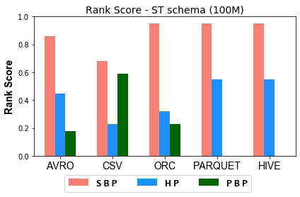
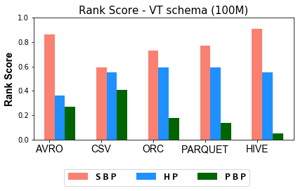
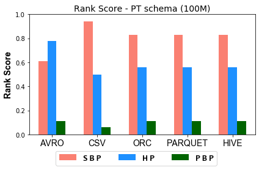
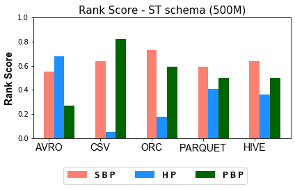
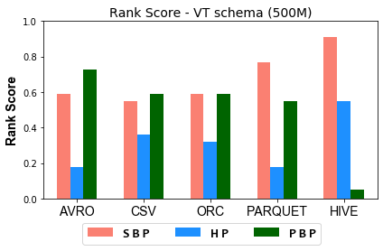
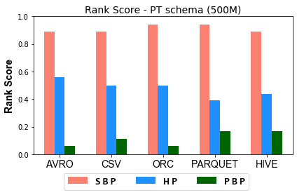

### Figures of experiment results for Partitioning
---

#### 100M Triples Partitioning techniques Ranking Scores

 

 

 

#### 500M Triples Partitioning techniques Ranking Scores

 

 

 

 
These figures show the comparative representation of partitioning techniques (i.e. Horizontally, Subject-based, Predicate-based) for 100M, and 500M Respectively.
