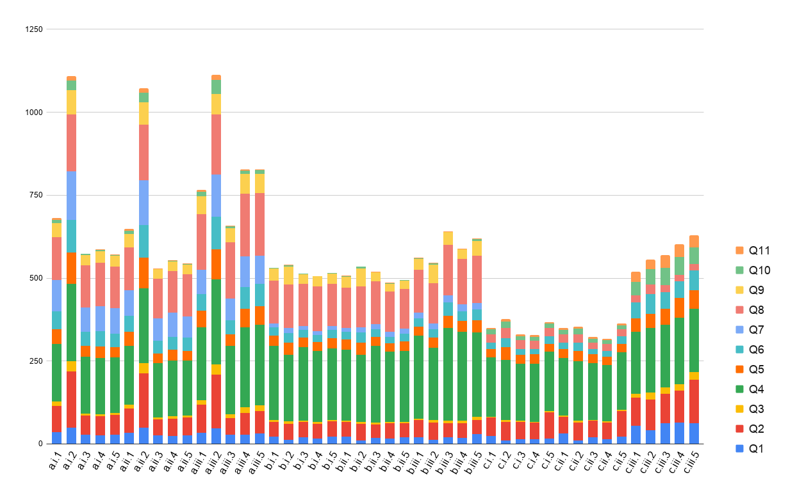
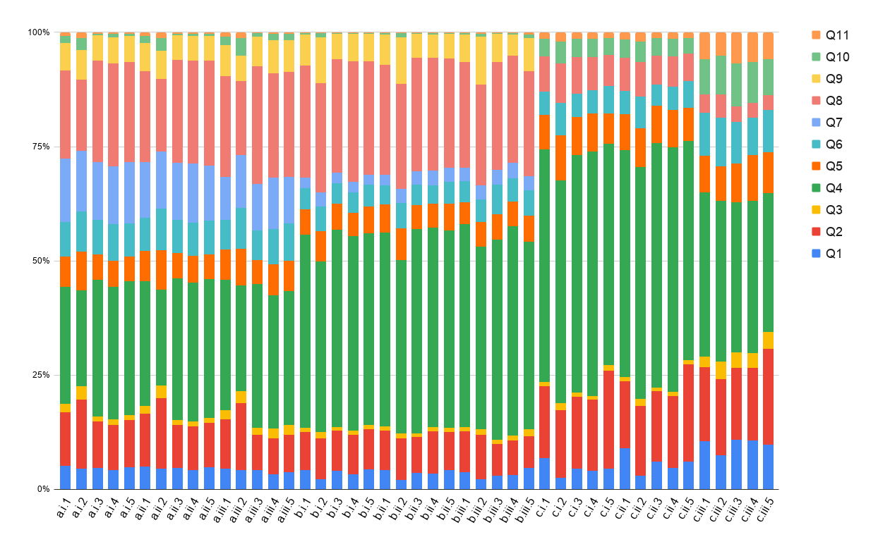
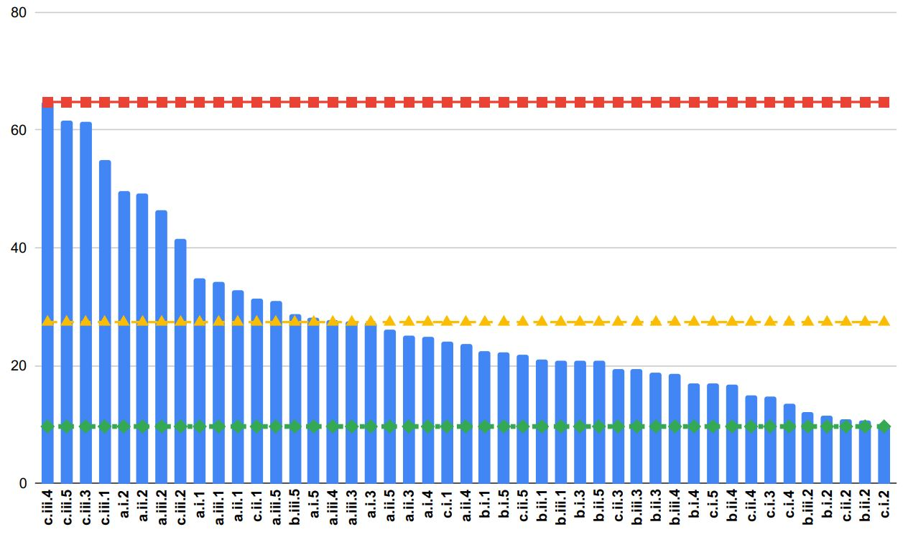
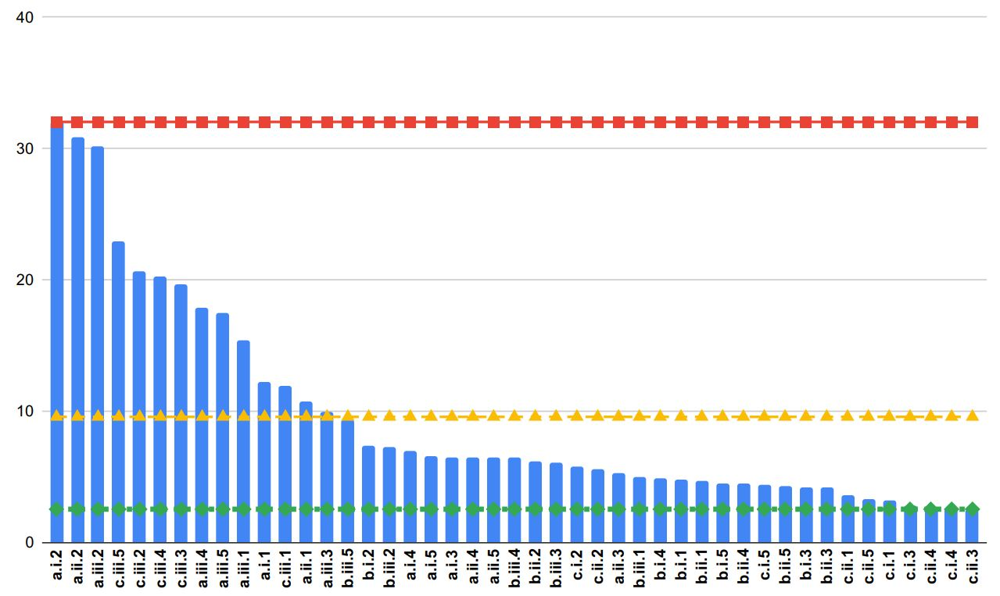
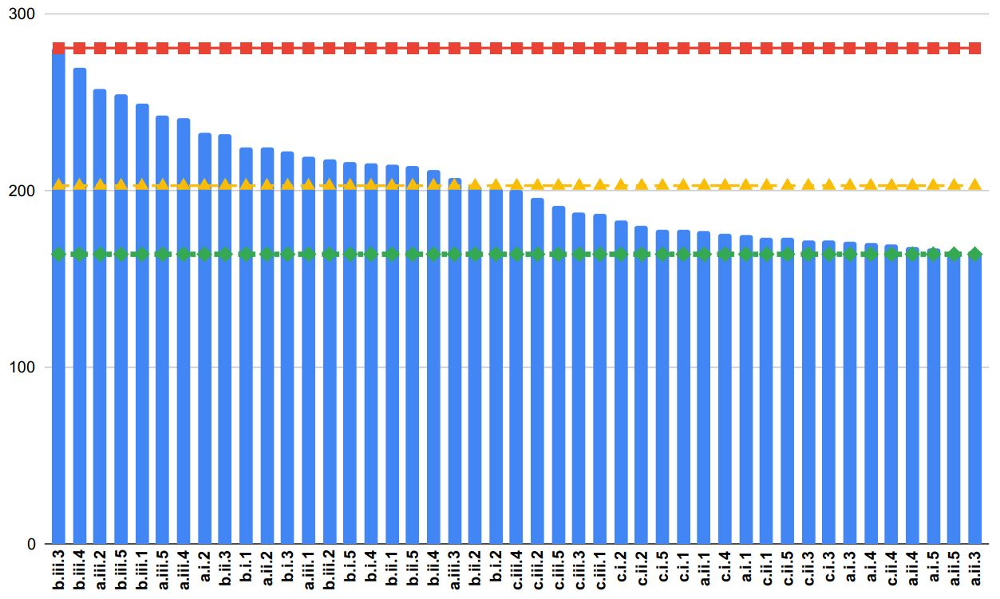
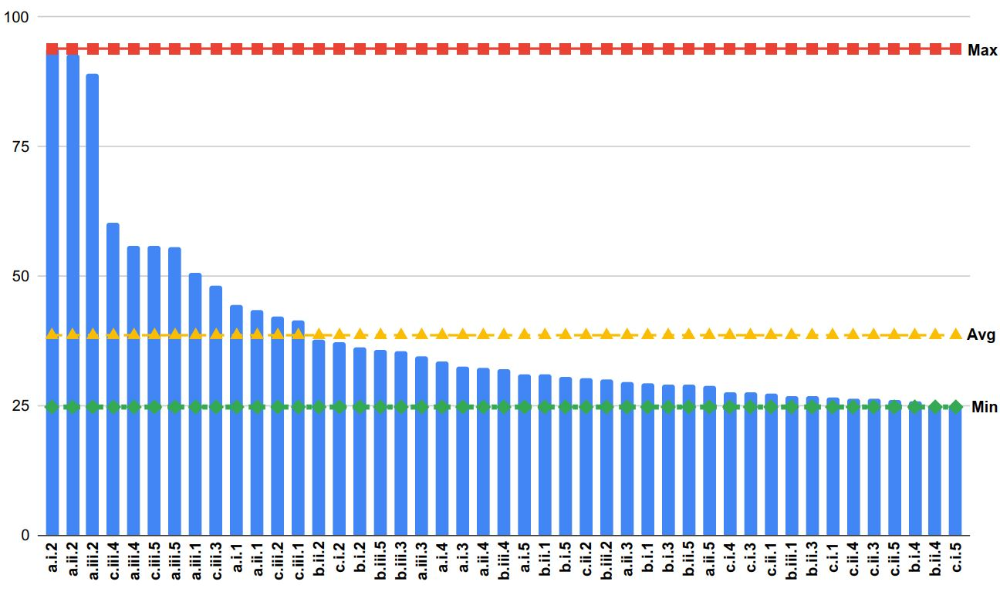
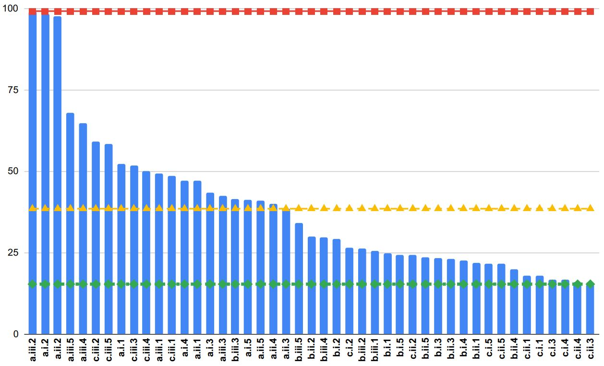
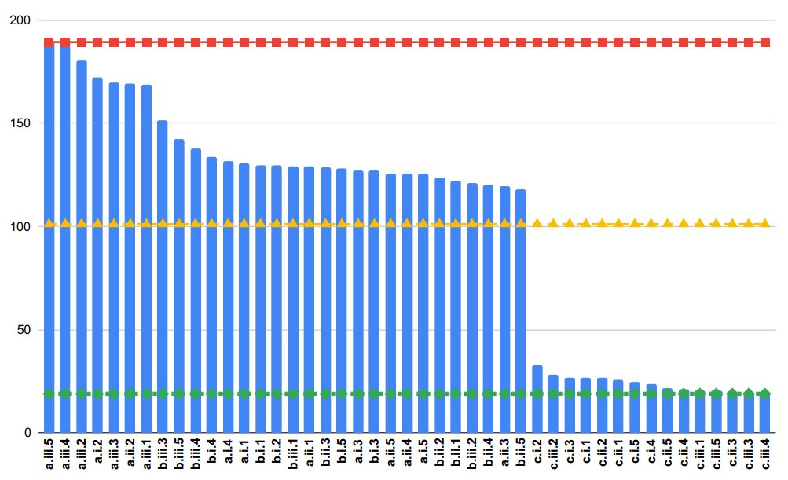
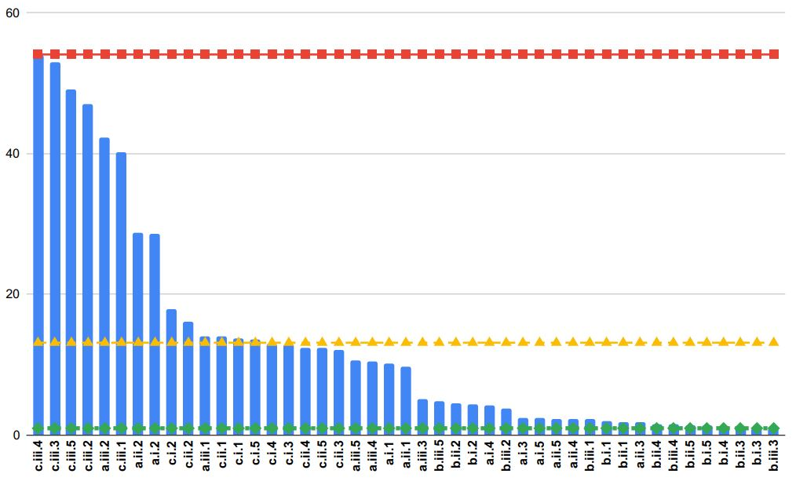
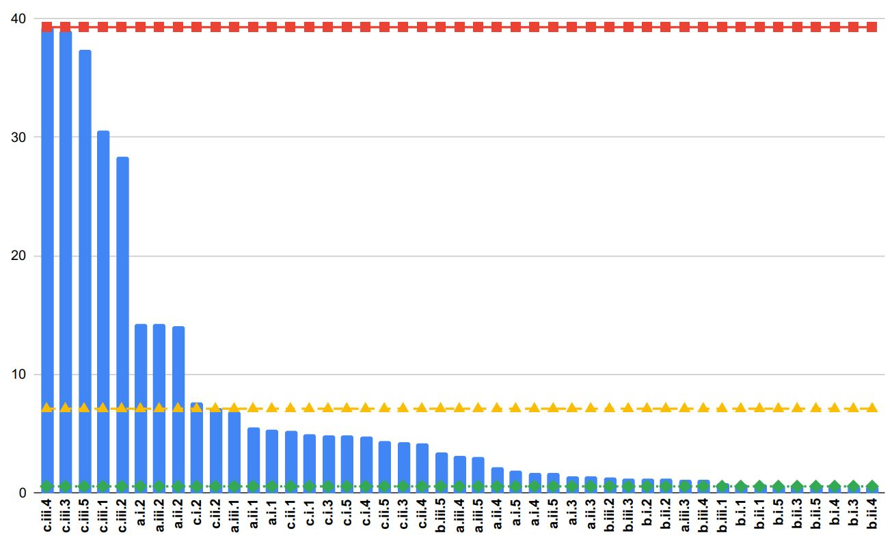

### Query Performance for Configuration Combination

The following figure quantitatively shows the impact of certain query over the selected [confguration combination](https://github.com/DataSystemsGroupUT/SPARKSQLRDFBenchmarking/blob/master/docs/images/experiments.JPG). We can notice sevral interesting points:
- Q1, Q3, Q5 are the least impacting queries (take the minimum running times across all the configuration combinations).
- Q4, followed by Q8, then Q2 are the highes impactful queries across all the configuration cominations.
- Intrestingly, we can notice that Q8 has high impact (long running times) with the ST and VT schemas, taking long running times, while having very low running times with the PT schema. This can be shown more clearly from the stacked percentages figure.  

     
    <em>Confguration Combination Query performance</em>

   
  <em>Confguration Combination Query performance in Percentages</em>

 
The following figures show the best and worst confguration combinations for running the SP2Bench 11 queries. we run our experiments 5 times, and we take the average run time. 

* 100M Results

Notably, Figures of Q7 are missing since the query failed some times, while the results of Q9 bcause it is not implemented in the third schema (PT).

**Q1** 
 

**Q2** 
 

**Q3** 
 

**Q4** 
 

**Q5** 
 

**Q6** 
 

**Q8** 
 

**Q10** 
 

**Q11** 
 
