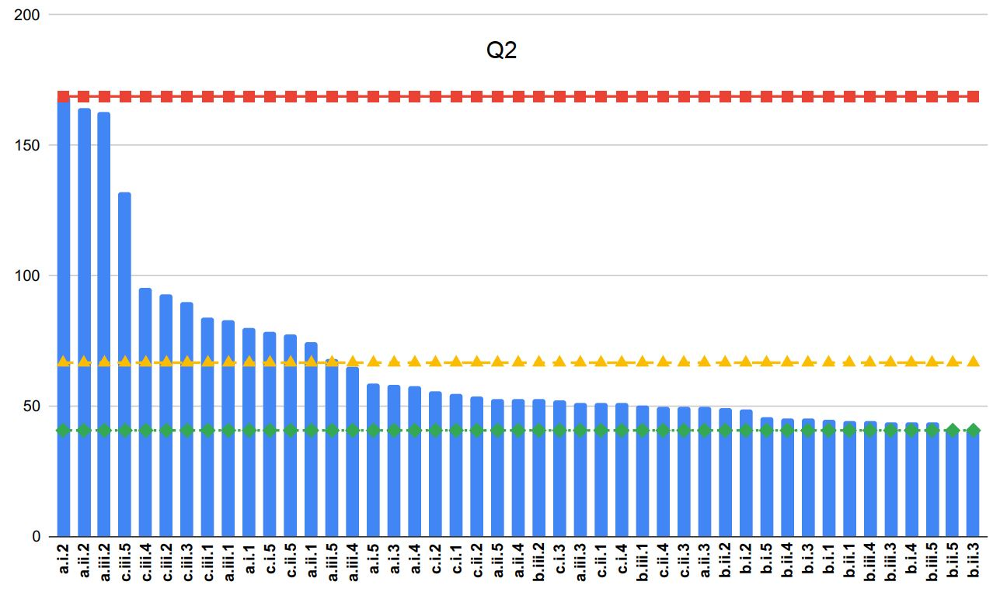

### Query Performance for Configuration Combination

The following figures show the best and worst confguration combinations for running the SP2Bench 11 queries. we run our experiments 5 times, and we take the average run time. 

* 100M Results

Notably, Figures of Q7 are missing since the query failed some times, while the results of Q9 bcause it is not implemented in the third schema (PT).

**Q1** 
 

**Q2** 
 

**Q3** 
 

**Q4** 
 

**Q5** 
 

**Q6** 
 

**Q8** 
 

**Q10** 
 

**Q11** 
 
