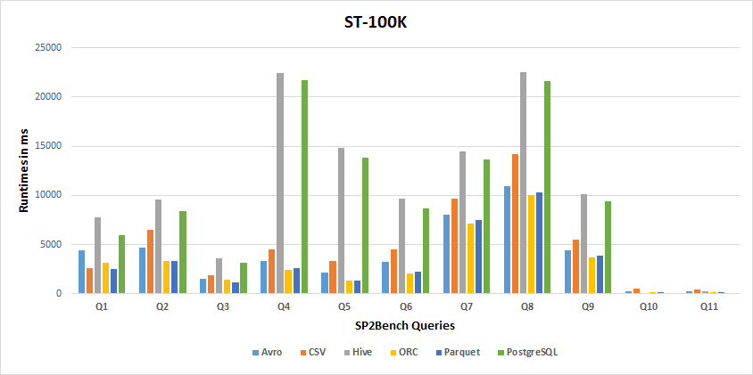
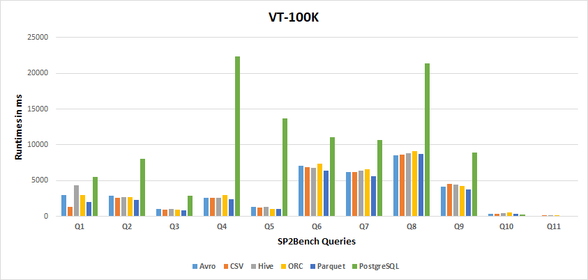
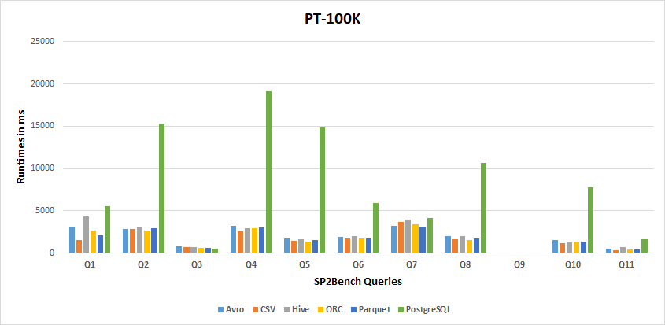
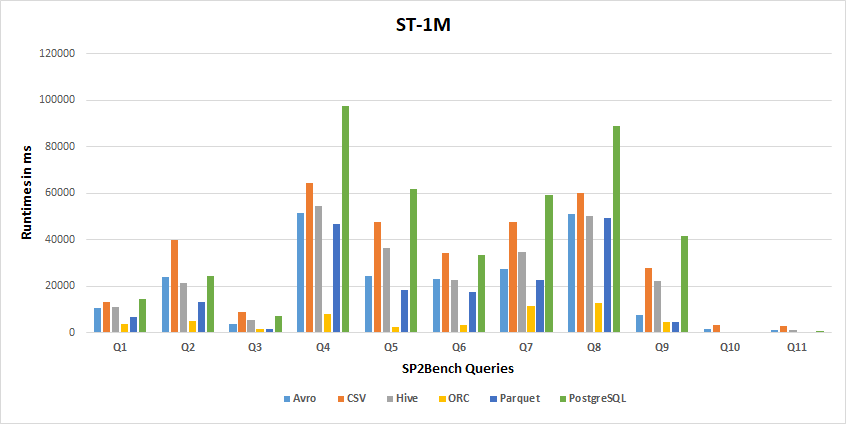
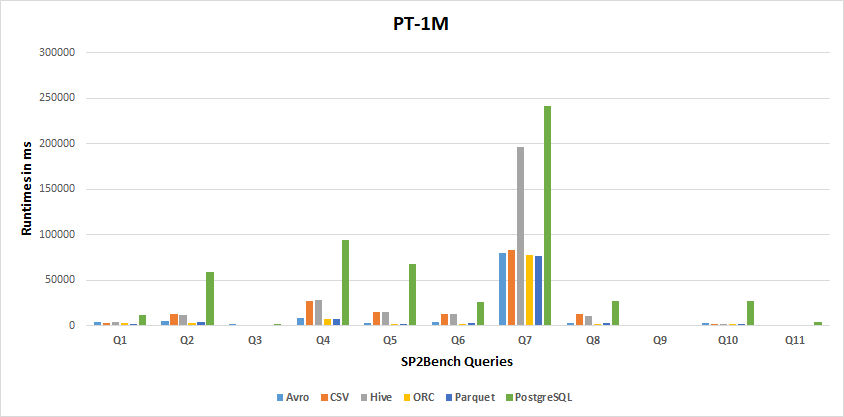
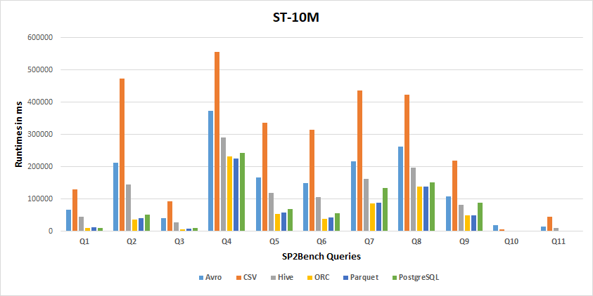

### Query Performance for Configuration Combination

The following figures show the best and worst confguration combinations for running the SP2Bench 11 queries. we run our experiments 5 times, and we take the average run time. 

* 100M Results
 
 
 

 
 
 

 
 
 
