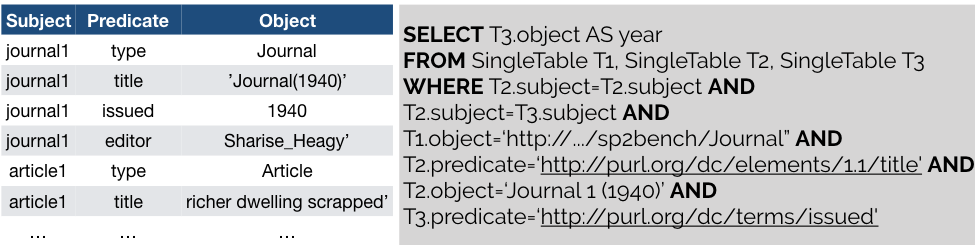
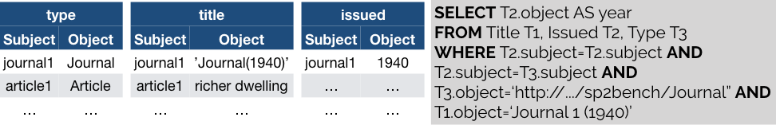
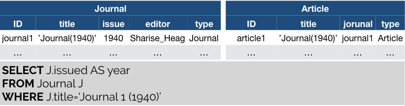
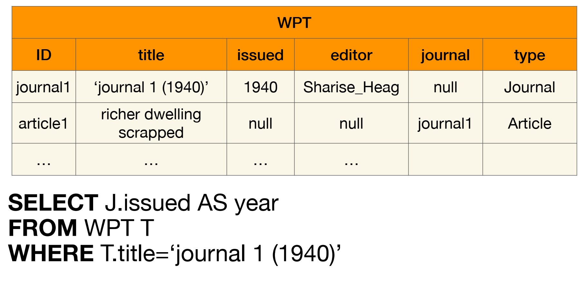
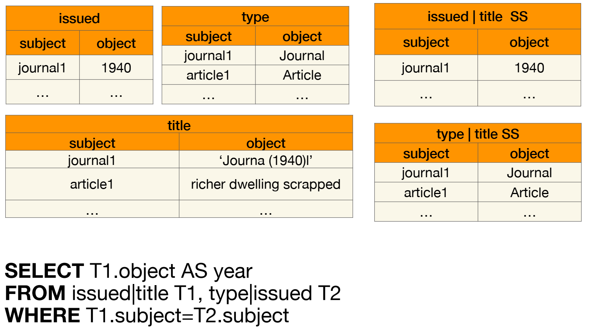
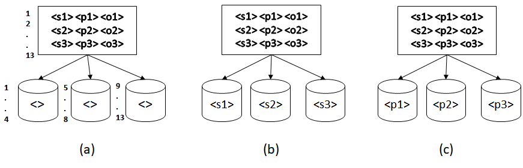
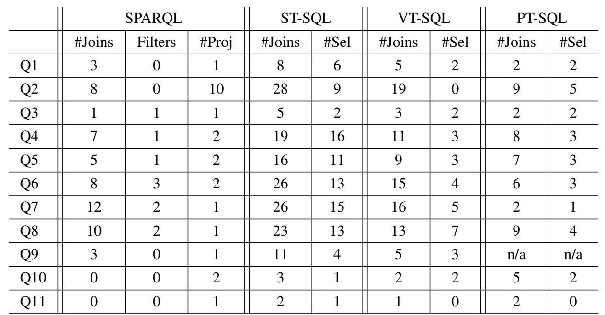
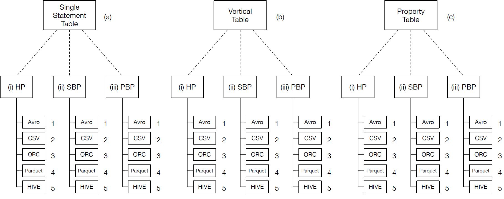
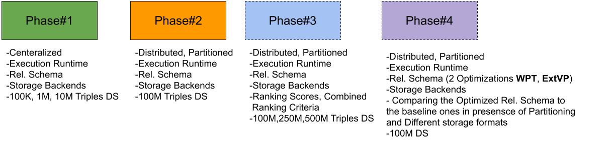

# SPARKSQL RDF Processing Benchmarking
### Project description
In this Project, we present a systematic comparison of the relevant RDF relational schemas, i.e., Single Statement Table, Property Tables or Vertically-Partitioned Tables queried using Apache Spark. We evaluate the performance Spark SQL querying engine for processing SPARQL queries using three different storage back-ends, namely, PostgresSQL, Hive, and HDFS. For the latter one, we compare four different data formats (CSV, ORC, Avro, and Parquet). We drove our experiment using a representative query workloads from the SP2Bench benchmark scenario. The results of our experiments show many interesting insights about the impact of the relational encoding scheme, storage backends and storage formats on the performance of the query execution process.

## Spark-SQL
-----
Spark-SQL is one of the most popular high-level libraries of Apache Spark targeted for processing structured datasets using the DataFrames data abstraction, and optimized by means of the Catalyst query optimizer.

## RDF Relational schemas
-----
We present a systematic comparison of three relevant RDF relational schemas such as _Single Statement Table_, _Property Tables_, and _Vertically-Partitioned Tables_  queried using Apache Spark. 

**Single Statement Table** requires  storing RDF datasets in a single triples table of three columns that represent the three components of the RDF triple, i.e., Subject, Predicate, and Object.

**Vertically-Partitioned Tables** is an alterna-tive schema storage in which the RDF triples table is decomposed into a table of two columns (Subject, Object) for each unique property  in  the  RDF  dataset  such  that  the  first  (subject) column contains all subject URIs of that unique property, and the second (object) contains all the object values (URIs and Literals) for those subjects

**Property Tables** is proposed to cluster multiple RDF properties as n-ary table columns for the same subject to group entities that are similar instructure.

For our new extension of the Phase #2 of this paper, we include two other Relational schemata to our experiemtns (The Wide Property Table ["WPT"], and the Extended Vertical Tables ["ExtVP"]).

**Wide Property Table** extends the PT schema for optimizing star-shaped SPARQL queries. WPT aims at representing the whole RDF dataset into a single unified table. Such table uses all RDF properties in the dataset as columns.

**Extended Vertical Tables ["ExtVP"]** aims at minimizing the size of input data during query evaluation [22]. In particular, ExtVP minimizes data skewness and eliminates dangling triples (i.e. triples that do not have
a join partner) that do not contribute to any join in the query. This extension is inspired by the Semi-Join  reductions.

### Storage Backends
-----
We evaluate the performance of SparkSQL querying engine for processing SPARQL queries using two different storage backends, namely, _Hive_, and _HDFS_. For the latter one, we compare four different data formats (_CSV_, _ORC_, _Avro_, and _Parquet_). 

### Partitioning techniques
-----
In addition, we show the impact of using three different RDF-based partitioning techniques with our relational scenario which are _Subject-based_, _Predicate-based_, and _Horizontal partitioning_.

 

- **Horizontal -Based Partitioning (HP)**: a technique that evenly partitions the data horizontally on the number of machines in the cluster. In particular, it partitions the relational tables we have according to (n) number of machines in the cluster.

- **Subject-Based Partitioning (SBP)**: a technique which distributes triples to the partitions according to the subject. As a result, all the triples that have the same subject are assumed to reside on the same partition. In our scenario, we applied spark partitioning using the subject- key with our different relational schema tables/Dataframes.

- **Predicate-Based Partitioning (PBP)**: a technique distributes triples to the partitions based on the RDF predicate. As a result, all the triples that have the same predicate are assumed to reside on the same partition. In our scenario, we applied Spark partitioning using the predicate- key with our different relational schema tables/Dataframes.

### Installation & Pre-Processing
-----
_[SP2Bench Data Generator](http://dbis.informatik.uni-freiburg.de/index.php?project=SP2B/download.php)_ generates RDF data in __N3__ format. _[Apache Jena](https://jena.apache.org/download/)_ is used to convert N3 into TDB files. Afterwards, we query TDB datasets using [SPARQL quereis](https://github.com/DataSystemsGroupUT/SPARKSQLRDFBenchmarking/tree/master/Datasets/QueriesTDB) to generate our different CSV relational schemas (i.e. ST, PT, and VT). We further, used Spark-SQL framework to convert the CSV data into other HDFS file formats such as (Parquet, ORC, Avro). You can find the FileFormats Conversion Porject source code [here](https://github.com/DataSystemsGroupUT/SPARKSQLRDFBenchmarking/blob/master/Datasets).

We used the same approach to load the data into the tables of the Apache Hive data warehouse using a created database for our datasets. Data conversion to Hive files requires to enable the support for Hive in the Spark session configuration using the _enableHiveSupport_ function. Notably, we have used another approach for creating Hive tables and loading data into them. We use [HQL queries](https://github.com/DataSystemsGroupUT/SPARKSQLRDFBenchmarking/tree/master/Datasets/HiveQueriesLoading) rough the hive CLI to create tables and load data in the form of the three differnt Relational schemas.

### Datasets
-----
SP2Bench Benchmark is scalable benchmark, whichj means it comprise a data generator that enables generatring arbitrarly large RDF datasets. For our First Phase of this project (Centralized Experiments), we generated datasets with the sizes [100K, 1M, and 10M] triples. While, for the second phase (Distributed experiments), we scale up to datasets with the sizes [100M, 500M, and 1B] triples.

For reproducability, We put here 100K triples dataset along side with their relational schema conversions in different file formats. you can find these datasets [here](https://github.com/DataSystemsGroupUT/SPARKSQLRDFBenchmarking/tree/master/Datasets). 

### SP2Bench Queries
-----
Sp2Bench  _SPARQL_ queries and their _SQL_ translations for ST,VT, and PT relational schemas (that we will use in our experiments, compliant with the SparkSQL) can be found [here](http://dbis.informatik.uni-freiburg.de/index.php?project=SP2B/translations.html)

- **Query Analysis:**  the following table shows the Sp2Bench queries analysis, i.e in terms of Number of Joins, Selections, Filters, and Projections.

### Experiments Architecture
-----
This figure shows the summary of our experiments configurations. It guides the reader through the naming process, i.e.,
(Schema.PartitioniningTechnique.Storage_Backend). For instance, (__a.ii.4__) corresponds to Single ST schema, SBP partitioning, and Parquet backend.

### Source Code
-----
- [Centralized(Single machine experiments)](https://github.com/DataSystemsGroupUT/SPARKSQLRDFBenchmarking/tree/master/ProjectSourceCode%5BCenteralized%5D/src/main/scala/ee/ut/cs/bigdata/sp2bench) 
- [Distributed(Spark Cluster experiments)](https://github.com/DataSystemsGroupUT/SPARKSQLRDFBenchmarking/tree/master/ProjectSourceCode%5BDistributed%5D/src/main/scala/ee/ut/cs/bigdata/sp2bench)

### Experiments Running
-----
We used the Spark.time function by passing the spark.sql(query) query execution function as a parameter. The output of this function is the running time of evaluating the SQL query into the Spark environment using the Spark session interface. All queries are evaluated for all schemas and partitioned horizontally (HP), or over subject and predicate (SBP, PBP respectively), and on top of all the different storage backends Hive, and the HDFS fle formats.

For each storage backend, partitioning method, and a relational schema, we run the experiments for all queries fve times (excluding the frst cold start run time, to avoid the warm-up bias, and computed an average of the other four
run times).

### Scripts
-----
In the directory of [Scirpts](https://github.com/DataSystemsGroupUT/SPARKSQLRDFBenchmarking/tree/master/Scripts), we share full scripts we used in our benchmaking experiments to make all computations and analysis as well as plotting all the figures over the logs of the experiments.

### Results
-----
* [Centralized Experiments](ResultsCenteralized.md)
  
  * Distributed Experiments
    * [Execution Runtimes](DistributedExperiments.md)
    * [Execution Runtimes with Categorizing Figures Long/Short Running Queries](DistributedExperiments_Long_Short_RunningTime_Queries.md)
    * [Relational Schema Ranking Scores](SchemaRanking.md)
    * [Partitioning Techs. Ranking Scores](PartitioningRanking.md)
    * [Storage Backends Ranking Scores](StorageRanking.md)
    * [Best and Worst Configuration Cominataion (Schema, Storage, Partitioning) '100M' ](QueryPerformanceforConfigs.md)
    * [Download The Results Sheets For all the datsets](https://github.com/DataSystemsGroupUT/SPARKSQLRDFBenchmarking/tree/master/results)
  
  
    
### Project Phases
-----

 

#### Phase#1
In the frst phase of our work, we presented a systematic analysis of the performance of Spark-SQL query engine (mainly
the execution time) for answering SPARQL queries over RDF repositories on a centralized single-machine. In particular, we have
performed our experiments considering: (i) alternative relational schemas for RDF, i.e., Single Statement Tables, Vertical Tables, and Property Tables; (ii) various storage backends, i.e., PostgreSQL, Hive, and HDFS, and (iii) and different data formats (e.g. CSV, Avro, Parquet, ORC). We conducted experiments on RDF datasets with (100K, 1M, and 10M) triples.

#### Phase#2
In the second phase of our project, we conducted the same settings and configurations but differently in a distributed deployments with partitioning the data. In particular, we conducted our experiments in a Spark cluster of four machines. and we worked on a larger RDF dataset of 100M dataset. Notably, we don't use PostgreSQL anymore in this phase experiments.

#### Phase#3
In this phase also we conduct the phase#2 experimetns but with way larger datsets (100M, 500M, and 1B) triples. moreover, differently from the previous phase, we apply different ranking and combined ranking criteria to quantitively and effectively help practioners to choose the best configuration combinations in such complex solution space of different dimensions (schema, partitioning, and storage).

### Project Authors
 - [Mohamed Ragab](https://bigdata.cs.ut.ee/mohamed-ragab)
 - [Riccardo Tommasini](https://rictomm.me/)
 - [Sherif Sakr](http://kodu.ut.ee/~sakr/)
 - [Sadiq Eyvazov]() 

### Publications
----
Phase#1 of this project has been accepted at QuWeDa@ISWC conference in Auckland, New Zealand [PDF](http://ceur-ws.org/Vol-2496/paper5.pdf):

    Mohamed Ragab, Riccardo Tommasini and Sherif Sakr, Benchmarking SparkSQL under Alliterative RDF Relational Storage Backends, QuWeDa@ISWC 2019.

Phase#2 of this project has been accepted at Semantic Big Data (SBD 2020)@In conjunction with ACM SIGMOD 2020 in Portland, OR, USA [PDF](https://dl.acm.org/doi/10.1145/3391274.3393632):

	 Mohamed Ragab, Riccardo Tommasini, Sadiq Eyvazov and Sherif Sakr, Towards making sense of Spark-SQL performance for processing vast distributed RDF datasets, In Proceedings of The International Workshop on Semantic Big Data (SBD ’20).
    
### Licence
----
This work is mainianed by the [DataSystems Group](https://bigdata.cs.ut.ee/), University of Tartu, licensed under the terms of the GNU General Public License, version 3.0 (GPLv3)
