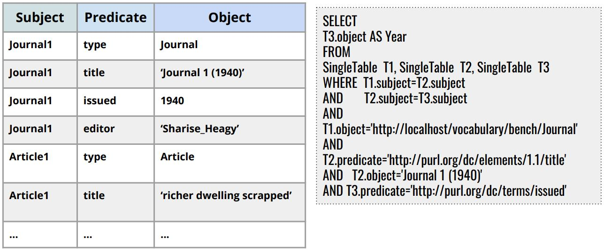
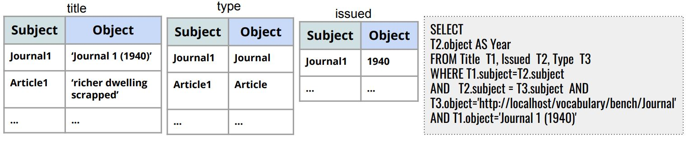
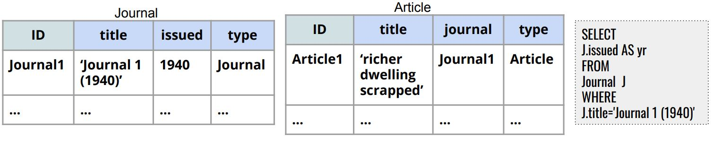

# SPARKSQL RDF Processing Benchmarking
### Project description
In this Project, we present a systematic comparison of there relevant RDF relational schemas, i.e., Single Statement Table, Property Tables or Vertically-Partitioned Tables queried using Apache Spark. We evaluate the performance Spark SQL querying engine for processing SPARQL queries using three different storage back-ends, namely, Postgres SQL, Hive, and HDFS. For the latter one, we compare four different data formats (CSV, ORC, Avro, and Parquet). We drove our experiment using a representative query workloads from the SP2Bench benchmark scenario. The results of our experiments show many interesting insights about the impact of the relational encoding scheme, storage backends and storage formats on the performance of the query execution process.

## Spark-SQL
-----
Spark-SQL is one of the most popular high-level libraries of Apache Spark targeted for processing structured datasets using the DataFrames data abstraction, and optimized by means of the Catalyst query optimizer.

## RDF Relational schemas
-----
We present a systematic comparison of three relevant RDF relational schemas such as _Single Statement Table_, _Property Tables_, and _Vertically-Partitioned Tables_  queried using Apache Spark. 

**Single Statement Table** requires  storing RDF datasets in a single triples table of three columns that represent the three components of the RDF triple, i.e., Subject, Predicate, and Object.

**Vertically-Partitioned Tables** is an alterna-tive schema storage in which the RDF triples table is decomposed into a table of two columns (Subject, Object) for each unique property  in  the  RDF  dataset  such  that  the  first  (subject) column contains all subject URIs of that unique property, and the second (object) contains all the object values (URIs and Literals) for those subjects

**Property Tables** is proposed to cluster multiple RDF properties as n-ary table columns for the same subject to group entities that are similar instructure.

### Storage backends/formats
-----
We evaluate the performance of SparkSQL querying engine for processing SPARQL queries using two different storage backends, namely, _Hive_, and _HDFS_. For the latter one, we compare four different data formats (_CSV_, _ORC_, _Avro_, and _Parquet_). 

### Partitioning techniques
-----
In addition, we show the impact of using three different RDF-based partitioning techniques with our relational scenario which are _Subject-based_, _Predicate-based_, and _Horizontal partitioning_. 

### Installation

_[SP2Bench Data Generator](http://dbis.informatik.uni-freiburg.de/index.php?project=SP2B/download.php)_ generates RDF data in N3 format. _[Apache Jena](https://jena.apache.org/download/)_ is used to convert N3 into TDB files. Afterwards, we query TDB datasets using SPARQL quereis to generate our different CSV relational schemas (i.e. ST, PT, and VT).

### SP2Bench Queries
The _SPARQL_ and _SQL_ queries can be found [here](http://dbis.informatik.uni-freiburg.de/index.php?project=SP2B/translations.html)

### Project Phases

 

### Publication

    M. Ragab, R. Tommasini and S. Sakr, Benchmarking SparkSQL under Alliterative RDF Relational Storage Backends (2019).
