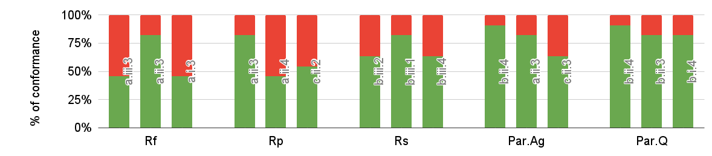
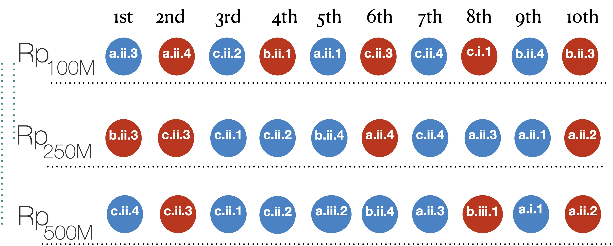

## Ranking Goodness

A ranking criterion aims at identifying the configurations that have the overall best results. In practice, We can consider a ranking criterion **"good"** if it does not suggest a low-performing configuration. In other words, we are not interested to be the best at any particular query as long as we are never the worst. Herein, we discuss how can we measure such **goodness**, i.e., **how to evaluate the ranking measure?**.

### Table of contents:
<ul>
  <li><a href="#goodcri"> The Proposed Goodness Measures </a></li>
  <ul>
    <li><a href="#confidence">  The Conformance Measure  </a></li>
    <ul>
      <li><a href="#exampleconfidence">  Examples of the Confidence measure </a></li>
    </ul>
    <li><a href="#coherence"> The Proposed Goodness Measures </a></li>
        <ul>
      <li><a href="#examplecoherence">  Examples of the Coherence measure  </a></li>
    </ul>
  </ul>
  

</ul>

This problem is well-known in **Information Retrieval** (IR) applications, where several metrics, e.g., *Precision* and *Recall*, are used to validate the ranking. Nevertheless, the main difference between *IR* and bench-ranking is the lack of ground truth. The most reasonable solution is to employ multiple ranking criteria and compare the prescriptions with the actual experimental results. 
However, this approach falls back to the problem relates to **ranking consensus**. Ranking consensus is different from combined ranking. The former is related to choosing between two preference sets, and the latter is about designing a ranking metric that considers multiple dimensions.

##### Def1: Rank Set
A rank set **R** is an ordered set of elements ordered by a ranking score. A rank index **ri** is the index of a ranked element **i** within a ranking set R , i.e., R|r_i|=i. We denote with **R^k** the left most subset of R of length **k**, and we denote with **R_x** the rank set calculated according to the Rank score **R_x**. 

<h3 id="goodcri"> Goodness Criteria: </h3>
In this regards, **Bench-ranking** proposes to measure the following:

- The ranking **confidence**:by checking how accurate a ranking criterion of its **top-ranked** configurations according to the actual query positioning of those configurations. 
- The ranking **coherence**, that is the **level of agreement** between two ranking sets using different ranking criteria or across different experiments. The invariant in our case is the Scale (across different dataset sizes from 100-to-250, 250-500,100-500M datsets).

<h4 id="confidence">  1- The Conformance Measure </h4>

To measure the **confidence**, we propose the following approach described by the following equation:

  

Given the **top-k** subset of the ranking set R we count how many times its elements occur in the bottom-h subset of the ranking set Q_h(i), which corresponds to the ranking set obtained by using the execution time of query **Q_i** as ranking criterion, for each query. In other words, we look at the rank of the top-ranked configurations (by a ranking criteria R), and make sure by the above formula that they are not in the bottm-h query positions/ranked configurations. This is computed for all queries in the benchmark. the intuition is the ranking top ranked configuration shouldn't appear as worst performing for the queries.

**Table of best 3 configuration ranked by the criteria Rf,Rp, and Rs (single-dimensional criteria), across our experimental datasets**
<table class="tg">
<thead>
  <tr>
    <th class="tg-rvyq">Top-3 Configurations</th>
    <th class="tg-rvyq" colspan="3">100M</th>
    <th class="tg-rvyq" colspan="3">250M</th>
    <th class="tg-rvyq" colspan="3">500M</th>
  </tr>
</thead>
<tbody>
  <tr>
    <td class="tg-rvyq">Rs</td>
    <td class="tg-c3ow">b.iii.2</td>
    <td class="tg-c3ow">b.iii.1</td>
    <td class="tg-c3ow">b.iii.4</td>
    <td class="tg-c3ow">b.iii.1</td>
    <td class="tg-c3ow">b.iii.2</td>
    <td class="tg-c3ow">b.iii.3</td>
    <td class="tg-c3ow">b.iii.1</td>
    <td class="tg-c3ow">b.iii.2</td>
    <td class="tg-c3ow">b.iii.4</td>
  </tr>
  <tr>
    <td class="tg-rvyq">Rp</td>
    <td class="tg-c3ow">a.ii.3</td>
    <td class="tg-c3ow">a.ii.4</td>
    <td class="tg-c3ow">a.ii.5</td>
    <td class="tg-c3ow">a.ii.5</td>
    <td class="tg-c3ow">b.ii.3</td>
    <td class="tg-c3ow">c.ii.3</td>
    <td class="tg-c3ow">c.ii.3</td>
    <td class="tg-c3ow">c.ii.4</td>
    <td class="tg-c3ow">b.ii.5</td>
  </tr>
  <tr>
    <td class="tg-rvyq">Rf</td>
    <td class="tg-c3ow">a.iii.3</td>
    <td class="tg-c3ow">a.ii.3</td>
    <td class="tg-c3ow">c.ii.3</td>
    <td class="tg-c3ow">a.iii.3</td>
    <td class="tg-c3ow">a.ii.3</td>
    <td class="tg-c3ow">b.ii.4</td>
    <td class="tg-c3ow">a.ii.3</td>
    <td class="tg-c3ow">a.iii.3</td>
    <td class="tg-c3ow">b.i.4</td>
  </tr>
</tbody>
</table>

<h5 id="exampleconfidence"> Examples of the confidence Calculations</h5>

For instance, let's consider the **R_s** rank and the **100M** dataset evaluation. The top-3 ranked configurations (see the table above) are R_s (Top-3)={b.iii.2,b.iii.1, **b.iii.4**}} that overlaps only with the **bottom-3** ranked configurations query Q4, i.e., Q4_(bottom-3)={b.iii.3,b.iii.4,a.iii.2}. Thus, A(R_s [3])=1- (1/(11*3))=0.969.

To get a visualized intuition behind the conformance, The following figure shows the level of conformance of the top-ranked three configurations for the single-dimensional as well as pareto ranking criteria. 

**Example on one of the datsets (100M):**

Table below shows the "confidence" ratios calcuated for all the ranking criteria (i.e, [individual](IndividualRankingCriteria.md) **R_f, R_s,R_p**, and [combined](CombinedRankingCriteria.md) **AVG, WAvg, Rta**). The table show the top-3 ranked configurations for each criteria, alongside all the the benchmark queris ranking of these configurations. The column **"rank > 22"** checks whehther these configurations opted by each criteria are not worst than the **22** bottom-ranked configurations according to the queries. Notably, this **22** is arbitraily used, but we can use any number *restricting** or *relaxing* the confidence calculation in the formula. In these [sheets](https://docs.google.com/spreadsheets/d/1cff9-IVtg4d113TSkdGOBVCmOt6NCOdrorqFhK04g5E/edit?usp=sharing), you can find other examples of calculating the confidence with different **h-bottom** values other than *22* example.

<!-- <table class="tg">
<thead>
  <tr>
    <th class="tg-7btt" colspan="12">Confidence of each Ranking Criteria</th>
    <th class="tg-fymr" rowspan="3">rank &gt; 22</th>
    <th class="tg-fymr" rowspan="3">A(R)</th>
  </tr>
  <tr>
    <td class="tg-fymr">100M</td>
    <td class="tg-fymr">Q1</td>
    <td class="tg-fymr">Q2</td>
    <td class="tg-fymr">Q3</td>
    <td class="tg-fymr">Q4</td>
    <td class="tg-fymr">Q5</td>
    <td class="tg-fymr">Q6</td>
    <td class="tg-fymr">Q7</td>
    <td class="tg-fymr">Q8</td>
    <td class="tg-fymr">Q9</td>
    <td class="tg-fymr">Q10</td>
    <td class="tg-fymr">Q11</td>
  </tr>
  <tr>
    <td class="tg-rvyq" colspan="12">Rf</td>
  </tr>
</thead>
<tbody>
  <tr>
    <td class="tg-f8tv">a.iii.3</td>
    <td class="tg-c6of">29</td>
    <td class="tg-c6of">20</td>
    <td class="tg-c6of">32</td>
    <td class="tg-c6of">26</td>
    <td class="tg-c6of">27</td>
    <td class="tg-c6of">30</td>
    <td class="tg-c6of">18</td>
    <td class="tg-c6of">41</td>
    <td class="tg-c6of">20</td>
    <td class="tg-c6of">22</td>
    <td class="tg-c6of">11</td>
    <td class="tg-c3ow">6</td>
    <td class="tg-c3ow" rowspan="3">0.64</td>
  </tr>
  <tr>
    <td class="tg-f8tv">a.ii.3</td>
    <td class="tg-c6of">26</td>
    <td class="tg-c6of">14</td>
    <td class="tg-c6of">18</td>
    <td class="tg-c6of">1</td>
    <td class="tg-c6of">17</td>
    <td class="tg-c6of">25</td>
    <td class="tg-c6of">17</td>
    <td class="tg-c6of">17</td>
    <td class="tg-c6of">5</td>
    <td class="tg-c6of">9</td>
    <td class="tg-c6of">16</td>
    <td class="tg-c3ow">2</td>
  </tr>
  <tr>
    <td class="tg-f8tv">c.ii.3</td>
    <td class="tg-c6of">15</td>
    <td class="tg-c6of">15</td>
    <td class="tg-c6of">1</td>
    <td class="tg-c6of">9</td>
    <td class="tg-c6of">5</td>
    <td class="tg-c6of">1</td>
    <td class="tg-c6of">31</td>
    <td class="tg-c6of">3</td>
    <td class="tg-c6of">31</td>
    <td class="tg-c6of">27</td>
    <td class="tg-c6of">26</td>
    <td class="tg-c3ow">4</td>
  </tr>
  <tr>
    <td class="tg-8bgf" colspan="12">Rp</td>
    <td class="tg-c3ow" colspan="2"></td>
  </tr>
  <tr>
    <td class="tg-f8tv">a.ii.3</td>
    <td class="tg-c6of">26</td>
    <td class="tg-c6of">14</td>
    <td class="tg-c6of">18</td>
    <td class="tg-c6of">1</td>
    <td class="tg-c6of">17</td>
    <td class="tg-c6of">25</td>
    <td class="tg-c6of">17</td>
    <td class="tg-c6of">17</td>
    <td class="tg-c6of">5</td>
    <td class="tg-c6of">9</td>
    <td class="tg-c6of">16</td>
    <td class="tg-c3ow">2</td>
    <td class="tg-c3ow" rowspan="3">0.61</td>
  </tr>
  <tr>
    <td class="tg-f8tv">a.ii.5</td>
    <td class="tg-c6of">27</td>
    <td class="tg-c6of">24</td>
    <td class="tg-c6of">26</td>
    <td class="tg-c6of">2</td>
    <td class="tg-c6of">13</td>
    <td class="tg-c6of">27</td>
    <td class="tg-c6of">16</td>
    <td class="tg-c6of">24</td>
    <td class="tg-c6of">7</td>
    <td class="tg-c6of">14</td>
    <td class="tg-c6of">19</td>
    <td class="tg-c3ow">5</td>
  </tr>
  <tr>
    <td class="tg-f8tv">a.ii.4</td>
    <td class="tg-c6of">23</td>
    <td class="tg-c6of">23</td>
    <td class="tg-c6of">24</td>
    <td class="tg-c6of">4</td>
    <td class="tg-c6of">24</td>
    <td class="tg-c6of">26</td>
    <td class="tg-c6of">19</td>
    <td class="tg-c6of">23</td>
    <td class="tg-c6of">8</td>
    <td class="tg-c6of">13</td>
    <td class="tg-c6of">21</td>
    <td class="tg-c3ow">6</td>
  </tr>
  <tr>
    <td class="tg-8bgf" colspan="12">Rs</td>
    <td class="tg-c3ow" colspan="2"></td>
  </tr>
  <tr>
    <td class="tg-f8tv">b.iii.2</td>
    <td class="tg-c6of">5</td>
    <td class="tg-c6of">22</td>
    <td class="tg-c6of">29</td>
    <td class="tg-c6of">32</td>
    <td class="tg-c6of">18</td>
    <td class="tg-c6of">19</td>
    <td class="tg-c6of">11</td>
    <td class="tg-c6of">19</td>
    <td class="tg-c6of">25</td>
    <td class="tg-c6of">17</td>
    <td class="tg-c6of">15</td>
    <td class="tg-c3ow">3</td>
    <td class="tg-c3ow" rowspan="3">0.73</td>
  </tr>
  <tr>
    <td class="tg-f8tv">b.iii.1</td>
    <td class="tg-c6of">18</td>
    <td class="tg-c6of">17</td>
    <td class="tg-c6of">17</td>
    <td class="tg-c6of">41</td>
    <td class="tg-c6of">9</td>
    <td class="tg-c6of">18</td>
    <td class="tg-c6of">12</td>
    <td class="tg-c6of">30</td>
    <td class="tg-c6of">14</td>
    <td class="tg-c6of">12</td>
    <td class="tg-c6of">9</td>
    <td class="tg-c3ow">2</td>
  </tr>
  <tr>
    <td class="tg-f8tv">b.iii.4</td>
    <td class="tg-c6of">12</td>
    <td class="tg-c6of">6</td>
    <td class="tg-c6of">23</td>
    <td class="tg-c6of">44</td>
    <td class="tg-c6of">23</td>
    <td class="tg-c6of">22</td>
    <td class="tg-c6of">14</td>
    <td class="tg-c6of">36</td>
    <td class="tg-c6of">4</td>
    <td class="tg-c6of">7</td>
    <td class="tg-c6of">10</td>
    <td class="tg-c3ow">4</td>
  </tr>
  <tr>
    <td class="tg-8bgf" colspan="12">AVG</td>
    <td class="tg-c3ow" colspan="2"></td>
  </tr>
  <tr>
    <td class="tg-f8tv">b.ii.4</td>
    <td class="tg-c6of">9</td>
    <td class="tg-c6of">10</td>
    <td class="tg-c6of">12</td>
    <td class="tg-c6of">27</td>
    <td class="tg-c6of">2</td>
    <td class="tg-c6of">7</td>
    <td class="tg-c6of">6</td>
    <td class="tg-c6of">18</td>
    <td class="tg-c6of">1</td>
    <td class="tg-c6of">8</td>
    <td class="tg-c6of">2</td>
    <td class="tg-c3ow">1</td>
    <td class="tg-c3ow" rowspan="3">0.88</td>
  </tr>
  <tr>
    <td class="tg-f8tv">a.ii.3</td>
    <td class="tg-c6of">26</td>
    <td class="tg-c6of">14</td>
    <td class="tg-c6of">18</td>
    <td class="tg-c6of">1</td>
    <td class="tg-c6of">17</td>
    <td class="tg-c6of">25</td>
    <td class="tg-c6of">17</td>
    <td class="tg-c6of">17</td>
    <td class="tg-c6of">5</td>
    <td class="tg-c6of">9</td>
    <td class="tg-c6of">16</td>
    <td class="tg-c3ow">2</td>
  </tr>
  <tr>
    <td class="tg-f8tv">b.ii.5</td>
    <td class="tg-c6of">16</td>
    <td class="tg-c6of">2</td>
    <td class="tg-c6of">10</td>
    <td class="tg-c6of">28</td>
    <td class="tg-c6of">14</td>
    <td class="tg-c6of">14</td>
    <td class="tg-c6of">7</td>
    <td class="tg-c6of">16</td>
    <td class="tg-c6of">2</td>
    <td class="tg-c6of">6</td>
    <td class="tg-c6of">4</td>
    <td class="tg-c3ow">1</td>
  </tr>
  <tr>
    <td class="tg-8bgf" colspan="12">WAvg</td>
    <td class="tg-c3ow" colspan="2"></td>
  </tr>
  <tr>
    <td class="tg-f8tv">a.ii.3</td>
    <td class="tg-c6of">26</td>
    <td class="tg-c6of">14</td>
    <td class="tg-c6of">18</td>
    <td class="tg-c6of">1</td>
    <td class="tg-c6of">17</td>
    <td class="tg-c6of">25</td>
    <td class="tg-c6of">17</td>
    <td class="tg-c6of">17</td>
    <td class="tg-c6of">5</td>
    <td class="tg-c6of">9</td>
    <td class="tg-c6of">16</td>
    <td class="tg-c3ow">2</td>
    <td class="tg-c3ow" rowspan="3">0.79</td>
  </tr>
  <tr>
    <td class="tg-f8tv">b.ii.4</td>
    <td class="tg-c6of">9</td>
    <td class="tg-c6of">10</td>
    <td class="tg-c6of">12</td>
    <td class="tg-c6of">27</td>
    <td class="tg-c6of">2</td>
    <td class="tg-c6of">7</td>
    <td class="tg-c6of">6</td>
    <td class="tg-c6of">18</td>
    <td class="tg-c6of">1</td>
    <td class="tg-c6of">8</td>
    <td class="tg-c6of">2</td>
    <td class="tg-c3ow">1</td>
  </tr>
  <tr>
    <td class="tg-f8tv">c.ii.3</td>
    <td class="tg-c6of">15</td>
    <td class="tg-c6of">15</td>
    <td class="tg-c6of">1</td>
    <td class="tg-c6of">9</td>
    <td class="tg-c6of">5</td>
    <td class="tg-c6of">1</td>
    <td class="tg-c6of">31</td>
    <td class="tg-c6of">3</td>
    <td class="tg-c6of">31</td>
    <td class="tg-c6of">27</td>
    <td class="tg-c6of">26</td>
    <td class="tg-c3ow">4</td>
  </tr>
  <tr>
    <td class="tg-8bgf" colspan="12">Rta</td>
    <td class="tg-0pky" colspan="2"></td>
  </tr>
  <tr>
    <td class="tg-f8tv">b.ii.4</td>
    <td class="tg-c6of">9</td>
    <td class="tg-c6of">10</td>
    <td class="tg-c6of">12</td>
    <td class="tg-c6of">27</td>
    <td class="tg-c6of">2</td>
    <td class="tg-c6of">7</td>
    <td class="tg-c6of">6</td>
    <td class="tg-c6of">18</td>
    <td class="tg-c6of">1</td>
    <td class="tg-c6of">8</td>
    <td class="tg-c6of">2</td>
    <td class="tg-c3ow">1</td>
    <td class="tg-c3ow" rowspan="3">0.88</td>
  </tr>
  <tr>
    <td class="tg-f8tv">b.ii.5</td>
    <td class="tg-c6of">16</td>
    <td class="tg-c6of">2</td>
    <td class="tg-c6of">10</td>
    <td class="tg-c6of">28</td>
    <td class="tg-c6of">14</td>
    <td class="tg-c6of">14</td>
    <td class="tg-c6of">7</td>
    <td class="tg-c6of">16</td>
    <td class="tg-c6of">2</td>
    <td class="tg-c6of">6</td>
    <td class="tg-c6of">4</td>
    <td class="tg-c3ow">1</td>
  </tr>
  <tr>
    <td class="tg-f8tv">a.ii.3</td>
    <td class="tg-c6of">26</td>
    <td class="tg-c6of">14</td>
    <td class="tg-c6of">18</td>
    <td class="tg-c6of">1</td>
    <td class="tg-c6of">17</td>
    <td class="tg-c6of">25</td>
    <td class="tg-c6of">17</td>
    <td class="tg-c6of">17</td>
    <td class="tg-c6of">5</td>
    <td class="tg-c6of">9</td>
    <td class="tg-c6of">16</td>
    <td class="tg-c3ow">2</td>
  </tr>
</tbody>
</table> -->

<table class="tg">
<thead>
  <tr>
    <th class="tg-7btt" colspan="12">Confidence of each Ranking Criteria</th>
    <th class="tg-fymr" rowspan="3">rank &gt; 17</th>
    <th class="tg-fymr" rowspan="3">A(R)</th>
  </tr>
  <tr>
    <td class="tg-fymr">100M</td>
    <td class="tg-fymr">Q1</td>
    <td class="tg-fymr">Q2</td>
    <td class="tg-fymr">Q3</td>
    <td class="tg-fymr">Q4</td>
    <td class="tg-fymr">Q5</td>
    <td class="tg-fymr">Q6</td>
    <td class="tg-fymr">Q7</td>
    <td class="tg-fymr">Q8</td>
    <td class="tg-fymr">Q9</td>
    <td class="tg-fymr">Q10</td>
    <td class="tg-fymr">Q11</td>
  </tr>
  <tr>
    <td class="tg-rvyq" colspan="12">Rf</td>
  </tr>
</thead>
<tbody>
  <tr>
    <td class="tg-f8tv">a.iii.3</td>
    <td class="tg-c6of">29</td>
    <td class="tg-c6of">20</td>
    <td class="tg-c6of">32</td>
    <td class="tg-c6of">26</td>
    <td class="tg-c6of">27</td>
    <td class="tg-c6of">30</td>
    <td class="tg-c6of">18</td>
    <td class="tg-c6of">41</td>
    <td class="tg-c6of">20</td>
    <td class="tg-c6of">22</td>
    <td class="tg-c6of">11</td>
    <td class="tg-c3ow">6</td>
    <td class="tg-c3ow" rowspan="3">0.64</td>
  </tr>
  <tr>
    <td class="tg-f8tv">a.ii.3</td>
    <td class="tg-c6of">26</td>
    <td class="tg-c6of">14</td>
    <td class="tg-c6of">18</td>
    <td class="tg-c6of">1</td>
    <td class="tg-c6of">17</td>
    <td class="tg-c6of">25</td>
    <td class="tg-c6of">17</td>
    <td class="tg-c6of">17</td>
    <td class="tg-c6of">5</td>
    <td class="tg-c6of">9</td>
    <td class="tg-c6of">16</td>
    <td class="tg-c3ow">2</td>
  </tr>
  <tr>
    <td class="tg-f8tv">c.ii.3</td>
    <td class="tg-c6of">15</td>
    <td class="tg-c6of">15</td>
    <td class="tg-c6of">1</td>
    <td class="tg-c6of">9</td>
    <td class="tg-c6of">5</td>
    <td class="tg-c6of">1</td>
    <td class="tg-c6of">31</td>
    <td class="tg-c6of">3</td>
    <td class="tg-c6of">31</td>
    <td class="tg-c6of">27</td>
    <td class="tg-c6of">26</td>
    <td class="tg-c3ow">4</td>
  </tr>
  <tr>
    <td class="tg-8bgf" colspan="12">Rp</td>
    <td class="tg-c3ow" colspan="2"></td>
  </tr>
  <tr>
    <td class="tg-f8tv">a.ii.3</td>
    <td class="tg-c6of">26</td>
    <td class="tg-c6of">14</td>
    <td class="tg-c6of">18</td>
    <td class="tg-c6of">1</td>
    <td class="tg-c6of">17</td>
    <td class="tg-c6of">25</td>
    <td class="tg-c6of">17</td>
    <td class="tg-c6of">17</td>
    <td class="tg-c6of">5</td>
    <td class="tg-c6of">9</td>
    <td class="tg-c6of">16</td>
    <td class="tg-c3ow">2</td>
    <td class="tg-c3ow" rowspan="3">0.61</td>
  </tr>
  <tr>
    <td class="tg-f8tv">a.ii.5</td>
    <td class="tg-c6of">27</td>
    <td class="tg-c6of">24</td>
    <td class="tg-c6of">26</td>
    <td class="tg-c6of">2</td>
    <td class="tg-c6of">13</td>
    <td class="tg-c6of">27</td>
    <td class="tg-c6of">16</td>
    <td class="tg-c6of">24</td>
    <td class="tg-c6of">7</td>
    <td class="tg-c6of">14</td>
    <td class="tg-c6of">19</td>
    <td class="tg-c3ow">5</td>
  </tr>
  <tr>
    <td class="tg-f8tv">a.ii.4</td>
    <td class="tg-c6of">23</td>
    <td class="tg-c6of">23</td>
    <td class="tg-c6of">24</td>
    <td class="tg-c6of">4</td>
    <td class="tg-c6of">24</td>
    <td class="tg-c6of">26</td>
    <td class="tg-c6of">19</td>
    <td class="tg-c6of">23</td>
    <td class="tg-c6of">8</td>
    <td class="tg-c6of">13</td>
    <td class="tg-c6of">21</td>
    <td class="tg-c3ow">6</td>
  </tr>
  <tr>
    <td class="tg-8bgf" colspan="12">Rs</td>
    <td class="tg-c3ow" colspan="2"></td>
  </tr>
  <tr>
    <td class="tg-f8tv">b.iii.2</td>
    <td class="tg-c6of">5</td>
    <td class="tg-c6of">22</td>
    <td class="tg-c6of">29</td>
    <td class="tg-c6of">32</td>
    <td class="tg-c6of">18</td>
    <td class="tg-c6of">19</td>
    <td class="tg-c6of">11</td>
    <td class="tg-c6of">19</td>
    <td class="tg-c6of">25</td>
    <td class="tg-c6of">17</td>
    <td class="tg-c6of">15</td>
    <td class="tg-c3ow">3</td>
    <td class="tg-c3ow" rowspan="3">0.73</td>
  </tr>
  <tr>
    <td class="tg-f8tv">b.iii.1</td>
    <td class="tg-c6of">18</td>
    <td class="tg-c6of">17</td>
    <td class="tg-c6of">17</td>
    <td class="tg-c6of">41</td>
    <td class="tg-c6of">9</td>
    <td class="tg-c6of">18</td>
    <td class="tg-c6of">12</td>
    <td class="tg-c6of">30</td>
    <td class="tg-c6of">14</td>
    <td class="tg-c6of">12</td>
    <td class="tg-c6of">9</td>
    <td class="tg-c3ow">2</td>
  </tr>
  <tr>
    <td class="tg-f8tv">b.iii.4</td>
    <td class="tg-c6of">12</td>
    <td class="tg-c6of">6</td>
    <td class="tg-c6of">23</td>
    <td class="tg-c6of">44</td>
    <td class="tg-c6of">23</td>
    <td class="tg-c6of">22</td>
    <td class="tg-c6of">14</td>
    <td class="tg-c6of">36</td>
    <td class="tg-c6of">4</td>
    <td class="tg-c6of">7</td>
    <td class="tg-c6of">10</td>
    <td class="tg-c3ow">4</td>
  </tr>
  <tr>
    <td class="tg-8bgf" colspan="12">Pareto_agg</td>
    <td class="tg-c3ow" colspan="2"></td>
  </tr>
  <tr>
    <td class="tg-f8tv">b.ii.4</td>
    <td class="tg-c6of">9</td>
    <td class="tg-c6of">10</td>
    <td class="tg-c6of">12</td>
    <td class="tg-c6of">27</td>
    <td class="tg-c6of">2</td>
    <td class="tg-c6of">7</td>
    <td class="tg-c6of">6</td>
    <td class="tg-c6of">18</td>
    <td class="tg-c6of">1</td>
    <td class="tg-c6of">8</td>
    <td class="tg-c6of">2</td>
    <td class="tg-c3ow">1</td>
    <td class="tg-c3ow" rowspan="3">0.88</td>
  </tr>
  <tr>
    <td class="tg-f8tv">a.ii.3</td>
    <td class="tg-c6of">26</td>
    <td class="tg-c6of">14</td>
    <td class="tg-c6of">18</td>
    <td class="tg-c6of">1</td>
    <td class="tg-c6of">17</td>
    <td class="tg-c6of">25</td>
    <td class="tg-c6of">17</td>
    <td class="tg-c6of">17</td>
    <td class="tg-c6of">5</td>
    <td class="tg-c6of">9</td>
    <td class="tg-c6of">16</td>
    <td class="tg-c3ow">2</td>
  </tr>
  <tr>
    <td class="tg-f8tv">b.ii.5</td>
    <td class="tg-c6of">16</td>
    <td class="tg-c6of">2</td>
    <td class="tg-c6of">10</td>
    <td class="tg-c6of">28</td>
    <td class="tg-c6of">14</td>
    <td class="tg-c6of">14</td>
    <td class="tg-c6of">7</td>
    <td class="tg-c6of">16</td>
    <td class="tg-c6of">2</td>
    <td class="tg-c6of">6</td>
    <td class="tg-c6of">4</td>
    <td class="tg-c3ow">1</td>
  </tr>
  <tr>
    <td class="tg-8bgf" colspan="12">Pareto_Q</td>
    <td class="tg-c3ow" colspan="2"></td>
  </tr>
  <tr>
    <td class="tg-f8tv">a.ii.3</td>
    <td class="tg-c6of">26</td>
    <td class="tg-c6of">14</td>
    <td class="tg-c6of">18</td>
    <td class="tg-c6of">1</td>
    <td class="tg-c6of">17</td>
    <td class="tg-c6of">25</td>
    <td class="tg-c6of">17</td>
    <td class="tg-c6of">17</td>
    <td class="tg-c6of">5</td>
    <td class="tg-c6of">9</td>
    <td class="tg-c6of">16</td>
    <td class="tg-c3ow">2</td>
    <td class="tg-c3ow" rowspan="3">0.79</td>
  </tr>
  <tr>
    <td class="tg-f8tv">b.ii.4</td>
    <td class="tg-c6of">9</td>
    <td class="tg-c6of">10</td>
    <td class="tg-c6of">12</td>
    <td class="tg-c6of">27</td>
    <td class="tg-c6of">2</td>
    <td class="tg-c6of">7</td>
    <td class="tg-c6of">6</td>
    <td class="tg-c6of">18</td>
    <td class="tg-c6of">1</td>
    <td class="tg-c6of">8</td>
    <td class="tg-c6of">2</td>
    <td class="tg-c3ow">1</td>
  </tr>
  <tr>
    <td class="tg-f8tv">c.ii.3</td>
    <td class="tg-c6of">15</td>
    <td class="tg-c6of">15</td>
    <td class="tg-c6of">1</td>
    <td class="tg-c6of">9</td>
    <td class="tg-c6of">5</td>
    <td class="tg-c6of">1</td>
    <td class="tg-c6of">31</td>
    <td class="tg-c6of">3</td>
    <td class="tg-c6of">31</td>
    <td class="tg-c6of">27</td>
    <td class="tg-c6of">26</td>
    <td class="tg-c3ow">4</td>
  </tr>
  
</tbody>
</table>

**Note that:** the above results show the conformance for the configurations considering the Hive backend as a 5th stroage backend. However, for consistency we ommitted Hive from the calculations and kept only the HDFS file formats (CSV, Avro, ORC, and Parquet). Thus, we have new calculations and the configurations become 36 instead of 45 (i.e., by excluding configurations that include Hive as a storage backend).

The following table shows the conformance of each ranking criterion **top-3** configurations not being worse than the worst the 17 ranked configurations (i.e., better than the 17 ones, half of the distri-bution) according to the queries’ ranked sets.

|            | 100M | 250M  | 500M |
|------------|------|-------|------|
| R_f        | 58\% |  82\% | 70\% |
| R_p        | 61\% |  70\% | 58\% |
| R_s        | 70\% |  79\% | 79\% |
| Pareto_Agg | 79\% | 100\% | 82\% |
| Pareto_{Q} | 85\% | 100\% | 97\% |

All the selected ranking criteria perform very well for all the datasets. However, the single-dimensional criteria Rf , Rp, and Rs have lower conformance than the one based on Pareto. For instance, in the 100M, 250M, and 500M datasets, ParetoAgg. has a conformance of 79%, 100%, and 82%, respectively. The same pattern repeats with the ParetoQ version (with 85%,
100%, and 97%, respectively). In contrast, single-dimensional ranking criteria have relatively lower conformance of 58%, 82%, and 70% for Rf , 61%, 70%, and 58% for Rp, and 70%,
79%, and 79% for Rs, accordingly. 

The Conformance Figure shown above also depicts the level of conformance in green color, for the top-3 ranked configuration combinations. We can see that the level of conformance in the pareto raking criteria (multi-dimensional) is higher than the Rf, Rp, Rs single-dimensinal ranking criteria.  

The main reason behind these results is that single-dimensional criteria do not consider trade-offs across experimental dimensions, ultimately selecting the configuration that may under-perform in some queries. Meanwhile, Pareto-based ranking considers those trade-offs while optimizing all the dimensions simultaneously.

<h4 id="coherence">  2- The Coherence Measure: </h4>
To measure the coherence of each ranking criterion, we opt for **Kendall index**, which counts the number of pairwise disagreements between two rank sets: the larger the distance, the more dissimilar the rank sets are. Notably, we assume that rank sets have the same number of elements. Kendall’s distance between two rank sets R_1 and R_2, where P represent the set of unique pairs of distinct elements in the two sets can be calculated using the following equation:

<h5 id="examplecoherence"> Example of Coherence </h5>

For instance, the Kendall's index (**K**) between **R_s (Top-3)** for **100M** and **250M** is **0.33** (See table above of best_ranked_configuration for the individual criteria in the page). Indeed, there was only one disagreement out of three configurations observations (i.e, the cofiguration **b.ii.1** in the 250M dataset ranked better than **b.iii.2**).

Table below shows the **K** index as per Equation (2) in this page. All the criteria show a good coherence across different scales of the datasets (the lower the better). Indeed, scaling the datasets up, we realize small distances (i.e. indicating low changes in the ranking ordinals) for both individual and combined ranking criteria. Intuitively, if across scalability, the opted ranking criterion has high Kendall's index (i.e., high disagreement of the same ranking), it indicates the **inappropriateness** for ranking to describe the performance.

To give the intuituion behind the coherence metric by showing the top-10 ranked configuration for the same ranking criterion(R_p) (i.e., )
and across three different data scales. We can see examples of pairwise disagreements that occur by scaling from 100M to 250M, and also from 100M to the 500M dataset. For instance, in (100M -to-250M ), b.ii.3 was at the 10th rank in 100M, while being swapped to be at the 1st position in the 250M, and the 1st ranked configuration (a.ii.3) in the 100M swapped to be at the 8th rank in the 250M. Similar kind of disagreements are shown in the (100M-to-500M) scale-up transition.

Please note the swaps of colors, it starts as blue, red, blue,..., however with moving to larger data scales, color disagreements already occur there with the mentioned swaps.

<!-- <table class="tg">
<thead>
  <tr>
    <th class="tg-7btt">Dataset_i VS. Dataset_j</th>
    <th class="tg-rvyq">R_f</th>
    <th class="tg-rvyq">R_s</th>
    <th class="tg-rvyq">R_p</th>
    <th class="tg-rvyq">AVG</th>
    <th class="tg-rvyq">WAvg</th>
    <th class="tg-rvyq">R_ta</th>
  </tr>
</thead>
<tbody>
  <tr>
    <td class="tg-rvyq">100M vs 250M</td>
    <td class="tg-c3ow">0.17</td>
    <td class="tg-c3ow">0.07</td>
    <td class="tg-c3ow">0.17</td>
    <td class="tg-c3ow">0.18</td>
    <td class="tg-c3ow">0.18</td>
    <td class="tg-c3ow">0.17</td>
  </tr>
  <tr>
    <td class="tg-rvyq">100M vs 500M</td>
    <td class="tg-c3ow">0.17</td>
    <td class="tg-c3ow">0.07</td>
    <td class="tg-c3ow">0.28</td>
    <td class="tg-c3ow">0.19</td>
    <td class="tg-c3ow">0.20</td>
    <td class="tg-c3ow">0.19</td>
  </tr>
  <tr>
    <td class="tg-rvyq">250M vs 500M</td>
    <td class="tg-c3ow">0.17</td>
    <td class="tg-c3ow">0.09</td>
    <td class="tg-c3ow">0.21</td>
    <td class="tg-c3ow">0.17</td>
    <td class="tg-c3ow">0.17</td>
    <td class="tg-c3ow">0.15</td>
  </tr>
</tbody>
</table>
 -->

 <table class="tg">
<thead>
  <tr>
    <th class="tg-7btt">Dataset_i VS. Dataset_j</th>
    <th class="tg-rvyq">R_f</th>
    <th class="tg-rvyq">R_s</th>
    <th class="tg-rvyq">R_p</th>
    <th class="tg-rvyq">Pareto_Agg</th>
    <th class="tg-rvyq">Pareto_Q</th>
<!--     <th class="tg-rvyq">AVG</th>
    <th class="tg-rvyq">WAvg</th>
    <th class="tg-rvyq">R_ta</th> -->
  </tr>
</thead>
<tbody>
  <tr>
    <td class="tg-rvyq">100M vs 250M</td>
    <td class="tg-c3ow">0.13</td>
    <td class="tg-c3ow">0.18</td>
    <td class="tg-c3ow">0.06</td>
    <td class="tg-c3ow">0.19</td>
    <td class="tg-c3ow">0.24</td>
<!--     <td class="tg-c3ow">0.17</td> -->
  </tr>
  <tr>
    <td class="tg-rvyq">100M vs 500M</td>
    <td class="tg-c3ow">0.16</td>
    <td class="tg-c3ow">0.29</td>
    <td class="tg-c3ow">0.06</td>
    <td class="tg-c3ow">0.19</td>
    <td class="tg-c3ow">0.24</td>
<!--     <td class="tg-c3ow">0.19</td> -->
  </tr>
  <tr>
    <td class="tg-rvyq">250M vs 500M</td>
    <td class="tg-c3ow">0.13</td>
    <td class="tg-c3ow">0.19</td>
    <td class="tg-c3ow">0.07</td>
    <td class="tg-c3ow">0.13</td>
    <td class="tg-c3ow">0.18</td>
<!--     <td class="tg-c3ow">0.15</td> -->
  </tr>
</tbody>
</table>

The above table shows the results where the reading key is the lower, the better( i.e., high Kendall’s index means high disagreement across rank set). All the ranking criteria show high coherence across different scales of the datasets. Indeed, scaling the datasets does not excessively impact the rank sets’ order in all the ranking
criteria.

**Note** All the scripts for calculating the Kendall's index can be found in the [scripts](https://github.com/DataSystemsGroupUT/SPARKSQLRDFBenchmarking/tree/master/scripts) in this repo, and attached with the calculations [sheet](https://docs.google.com/spreadsheets/d/1cff9-IVtg4d113TSkdGOBVCmOt6NCOdrorqFhK04g5E/edit?usp=sharing).

<ul>
  <li style="display:inline;"><a href="https://datasystemsgrouput.github.io/SPARKSQLRDFBenchmarking/IndividualRankingCriteria.html" style=" margin-right: 50px ;padding: 0px 20px; word-wrap: normal; display: inline-block;   font: bold 11px Arial;  background-color: #EEEEEE;  border-top: 1px solid #CCCCCC;  border-right: 1px solid #333333;  border-bottom: 1px solid #333333;  border-left: 1px solid #CCCCCC;">Single-Dimensional Ranking Criteria</a></li>
  
 <li style="display:inline;"><a href="https://datasystemsgrouput.github.io/SPARKSQLRDFBenchmarking/MultiDimensionalRankingCriteria.html"  style="padding: 0px 20px; word-wrap: normal; display: inline-block;   font: bold 11px Arial;  background-color: #EEEEEE;  border-top: 1px solid #CCCCCC;  border-right: 1px solid #333333;  border-bottom: 1px solid #333333;  border-left: 1px solid #CCCCCC;">Multi-Dim. Ranking Criteria</a></li>
</ul>
  

