### Centeralized Experiments
#### Hardware and Software Configurations

Our experiments have been executed on a Desktop PC running a Cloudera Virtual Machine (VM) v.5.13 with Centos v7.3 Linux system, running on Intel(R) Core(TM) i5-8250U 1.60 GHz X64-based CPU and 24 GB DDR3 of physical memory. We also used a 64GB virtual hard drive for our VM. We used Spark V2.3 parcel on Cloudera VM to fully support Spark-SQL capabilities. We used the already installed Hive service on Cloudera VM (version:hive-1.1.0+cdh5.16.1+1431). We have installed a relational DB PostgreSQL (V. 11.4).

#### Query Performance, Schema and Storage Backends Analysis

you can find details about analysis of these previous centralized experiments results in our published [paper](http://ceur-ws.org/Vol-2496/paper5.pdf).

#### Query Performance Results

* **100K Results**
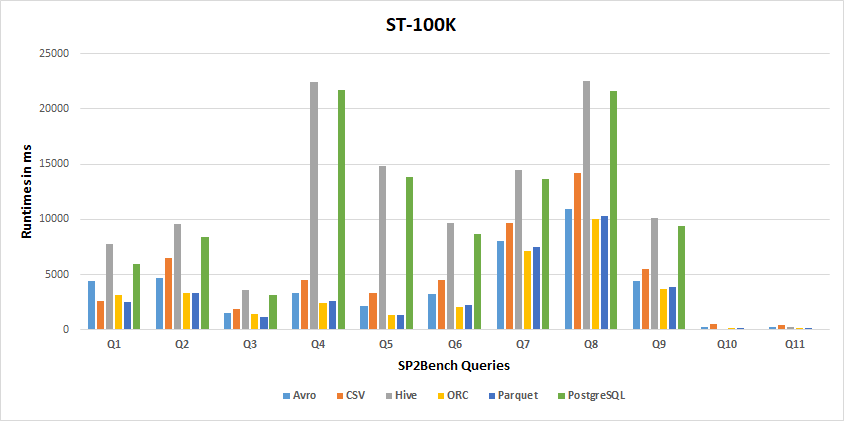 
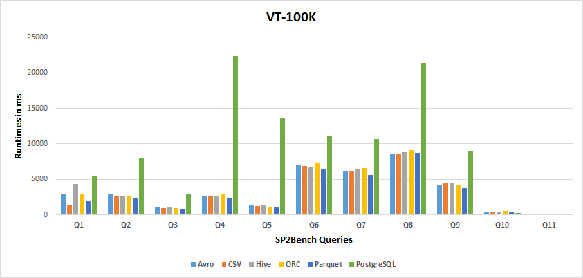 
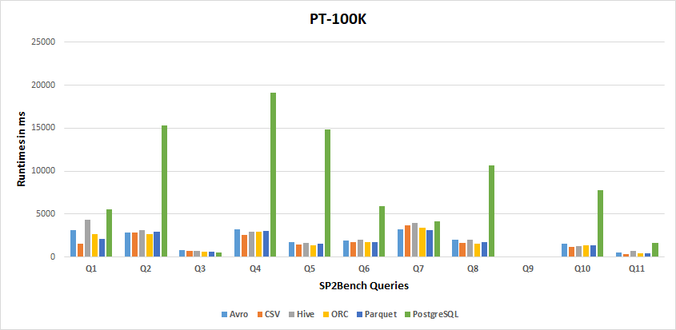 

* **1M Results**
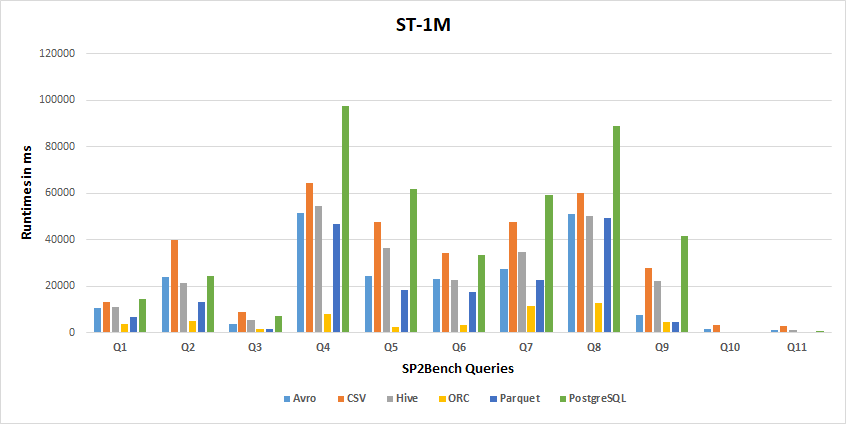 
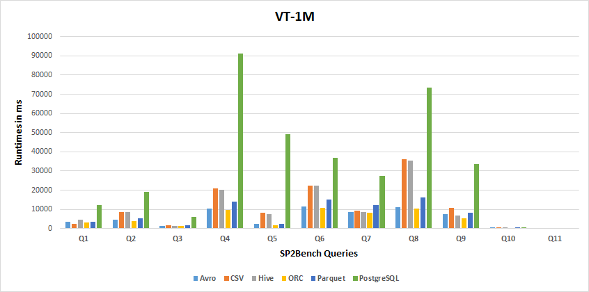 
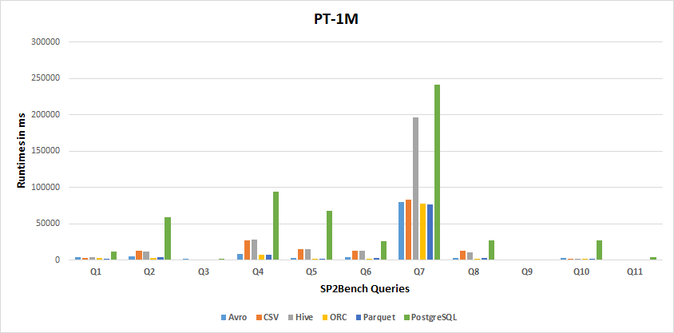 

* **10M Results**
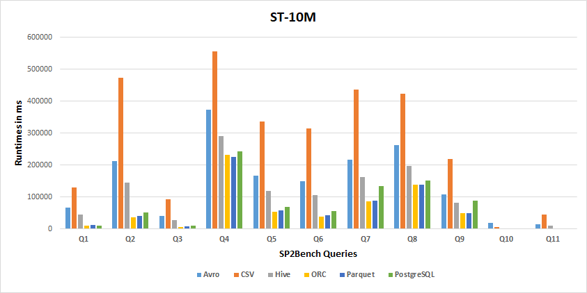 
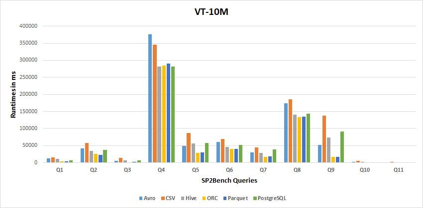 
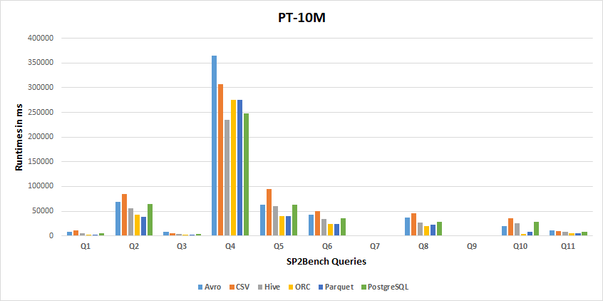 

#### Storage Backends Performance Results

Tthe following two tables report how many times a particular storage backend achieves the best or the lowest performance, respectively, considering the resultsof all experiments.

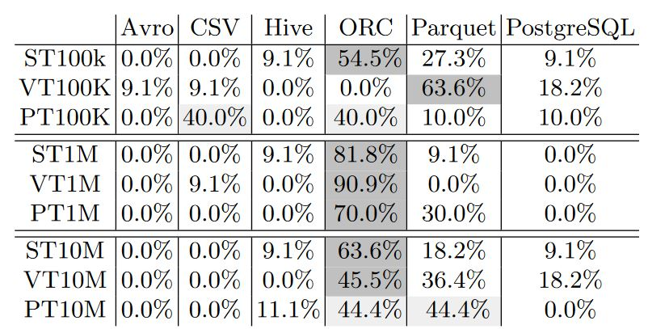 

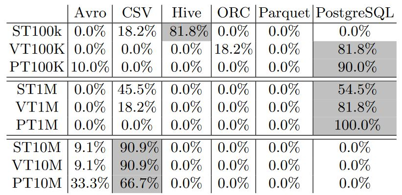 

