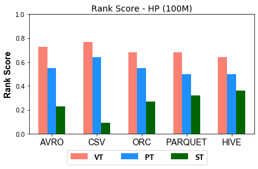
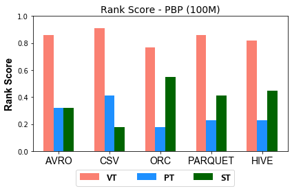
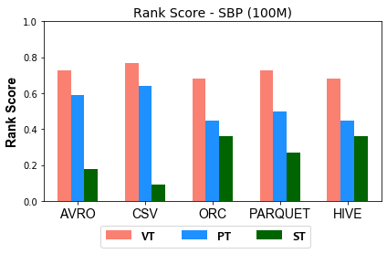
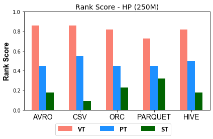
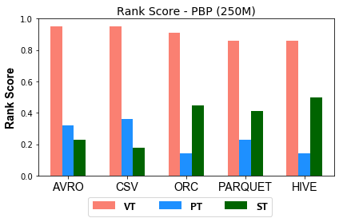
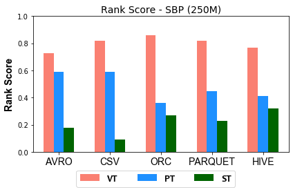
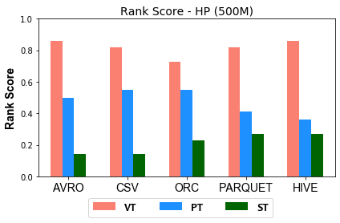
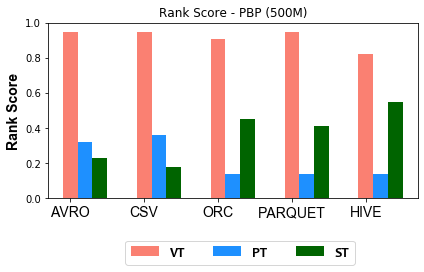
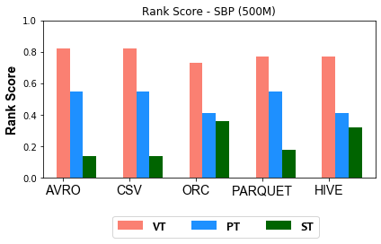

### Figures of experiment results for Relational Schema
---

These figures show the comparative representation of Relational Schema (i.e. ST, VT, PT) for 100M, 250M, and 500M respectively.

#### 100M Triples Relational Schema Ranking Scores

 

#### 250M Triples Relational Schema Ranking Scores

#### 500M Triples Relational Schema Ranking Scores

 
