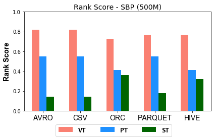

### Figures of experiment results for Relational Schema
---

These figures show the comparative representation of Relational Schema (i.e. ST, VT, PT) for 100M, 250M, and 500M respectively.

* Please note that the following ranking figures include Hive as a 5th storage backend. However, we have excluded Hive and for simpolicity kept only the HDFS storage file formats (CSV, AVro, ORC, and Parquet). Figures of ranking the schema dimension (excluding Hive) can be shown [here]((https://datasystemsgrouput.github.io/SPARKSQLRDFBenchmarking/SchemaRanking_NH). 

#### 100M Triples Relational Schema Ranking Scores

 

#### 250M Triples Relational Schema Ranking Scores

#### 500M Triples Relational Schema Ranking Scores

 
