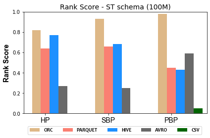
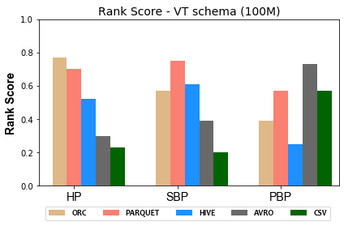
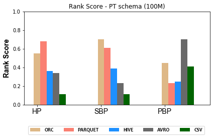
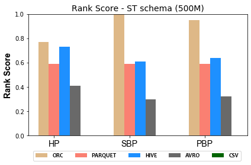
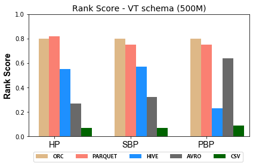
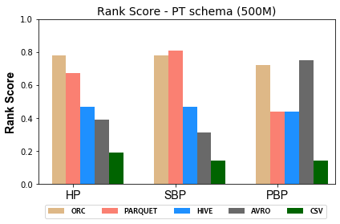

### Figures of experiment results for Storage Backends
---

#### 100M Triples Storage BackendsRanking Scores

              

#### 500M Triples Storage Backends Ranking Scores

              

 
These figures show the comparative representation of Storage backends (i.e. HDFS [CSV,AVRO, PARQUET, ORC], and HIVE) for 100M, and 500M Respectively.
