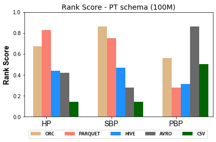

### Figures of experiment results for Storage Backends
---

These figures show the comparative representation of Storage backends (i.e. HDFS [CSV,AVRO, PARQUET, ORC], and HIVE) for 100M, and 500M Respectively.

#### 100M Triples Storage BackendsRanking Scores

 

 

 

#### 500M Triples Storage Backends Ranking Scores

 

 

 

 

