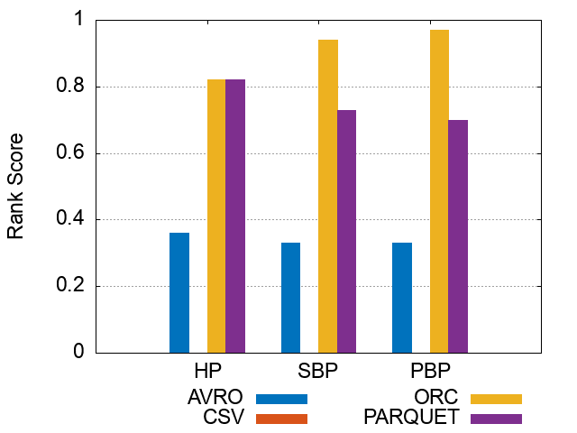
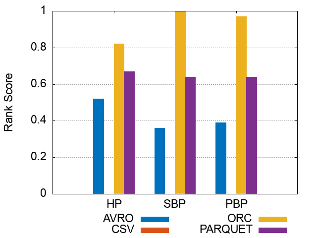

### Figures of experiment results for Storage Backends
---

These figures show the comparative representation of Storage file formats (i.e. HDFS [CSV,AVRO, PARQUET, ORC]) for 100M, 250M, and 500M respectively.

#### 100M Triples Storage BackendsRanking Scores

 

 

 

#### 250M Triples Storage Backends Ranking Scores

 

 

 

 

#### 500M Triples Storage Backends Ranking Scores

 

 

 

 

