## The effect of partitioning and storage formats on the performance of schemata (ExtVP/VP , and WPT/PT) (100M Triples Dataset Results)

#### WPT Vs. PT schemata performance using different partitioning techniques and file formats

* **Impact on WPT VS. PT **

* CSV-Horizontal Partitioning

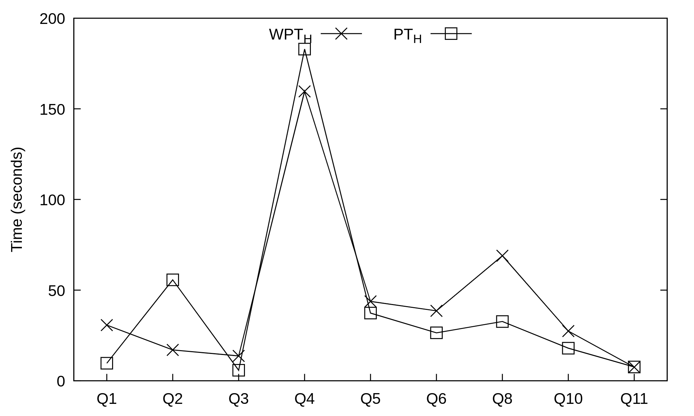

* CSV-Subject-based Partitioning

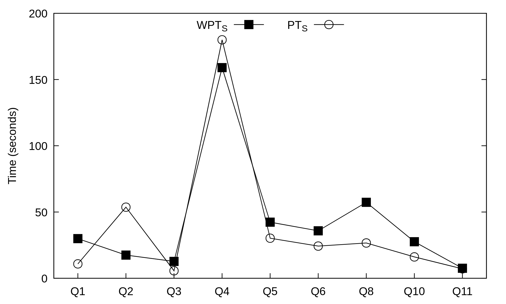

* AVRO-Horizontal Partitioning

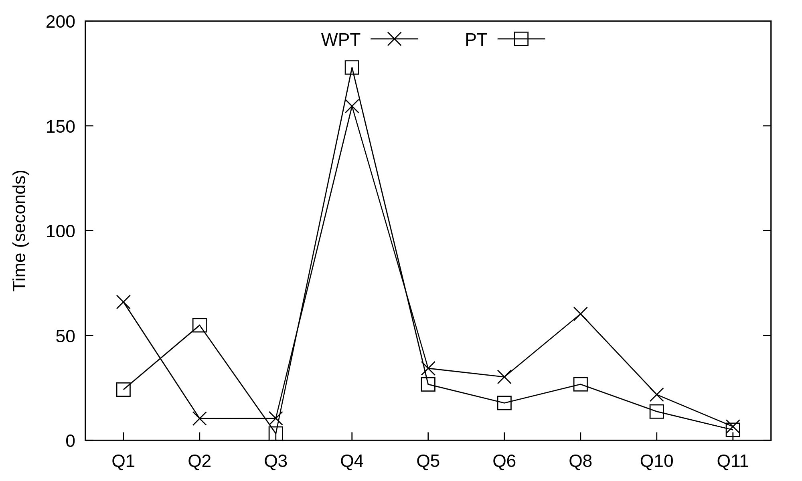

* AVRO-Subject-based Partitioning

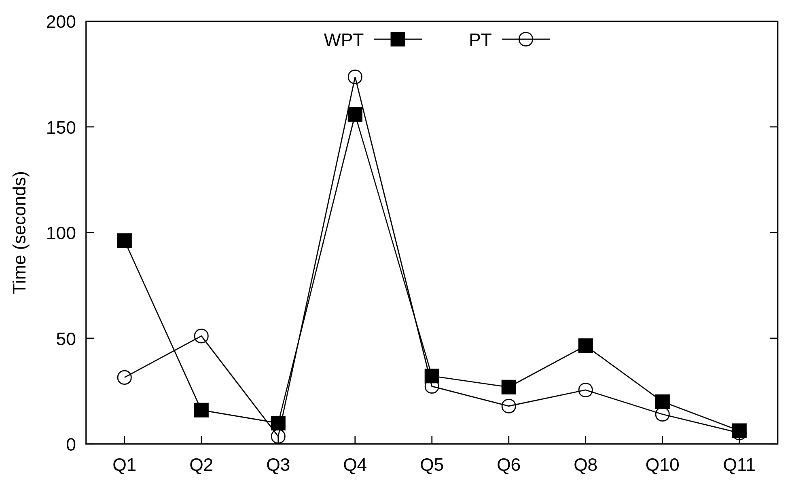

* ORC-Horizontal Partitioning

* ORC-Subject-based Partitioning

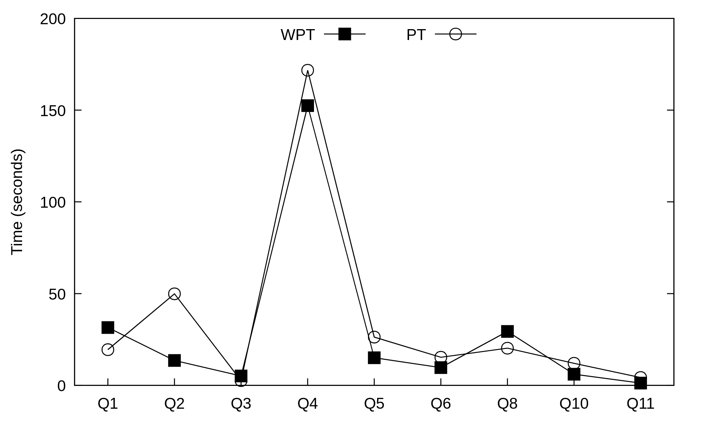

* Parquet-Horizontal Partitioning

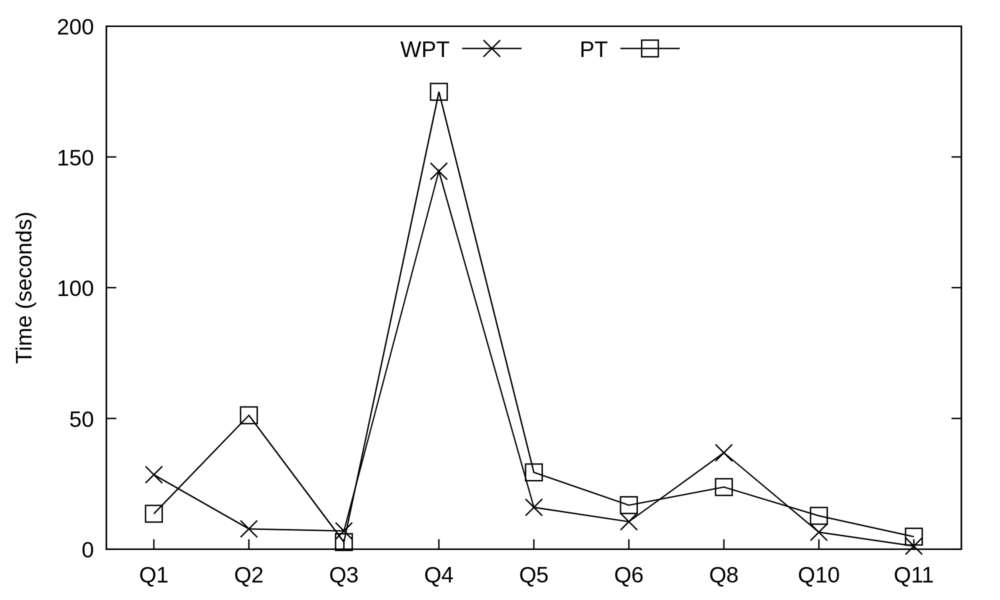

* Parquet-Subject-based Partitioning

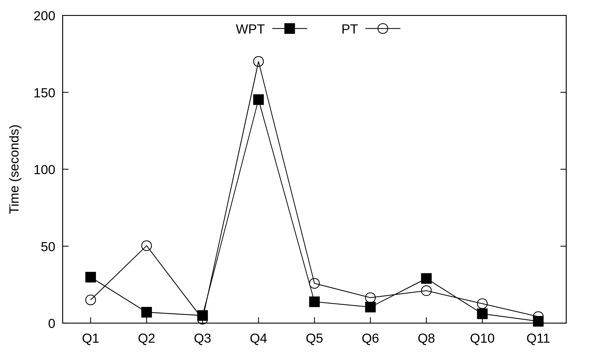

* **Impact on ExtVP VS. VP **

* CSV-Horizontal Partitioning

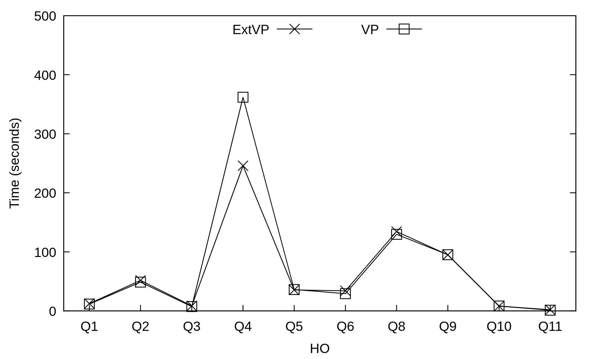

* CSV-Subject-based Partitioning

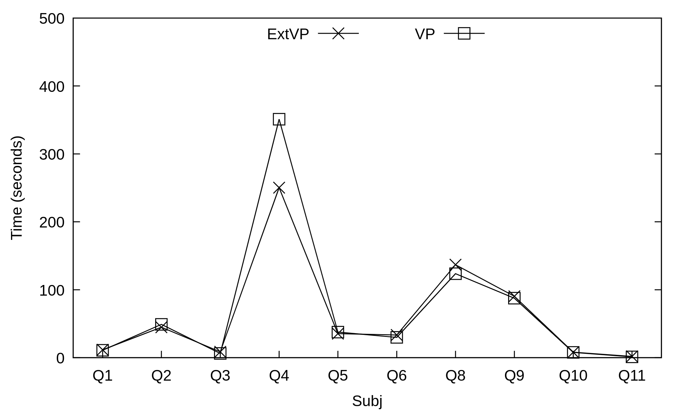

* CSV-Predicate-based Partitioning

* AVRO-Horizontal Partitioning

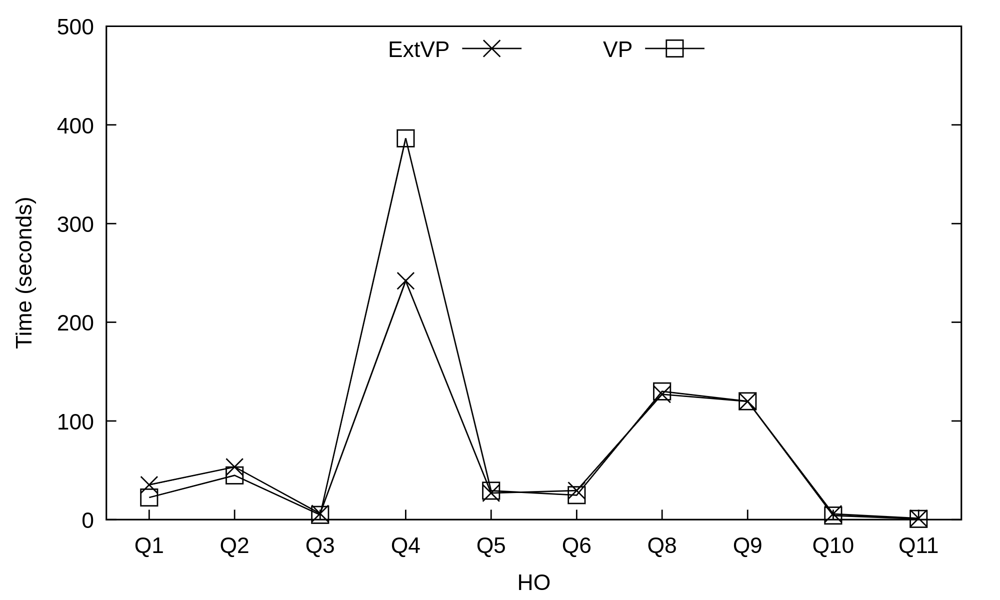

* AVRO-Subject-based Partitioning

* AVRO-Predicate-based Partitioning

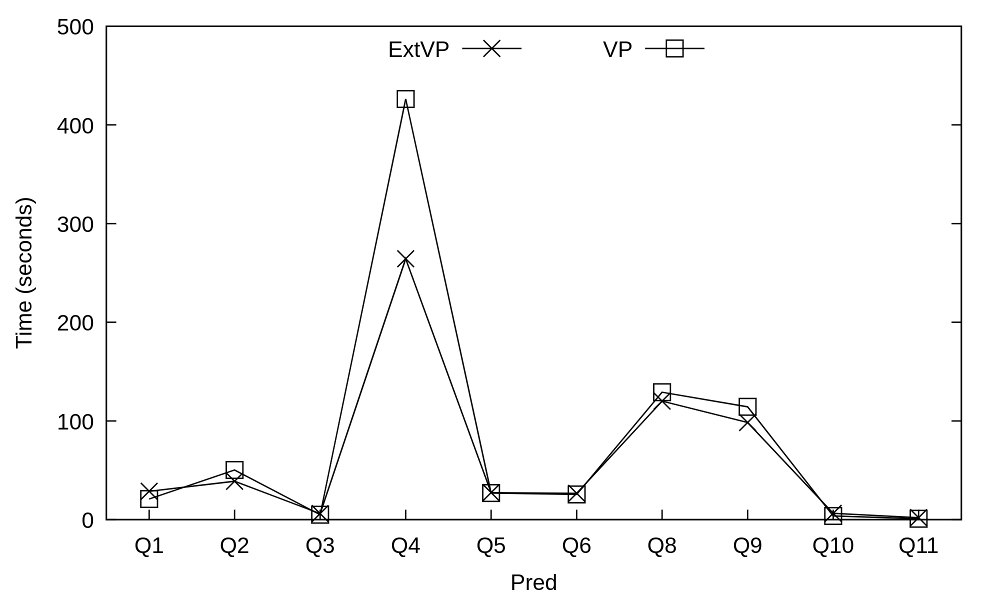

* ORC-Horizontal Partitioning

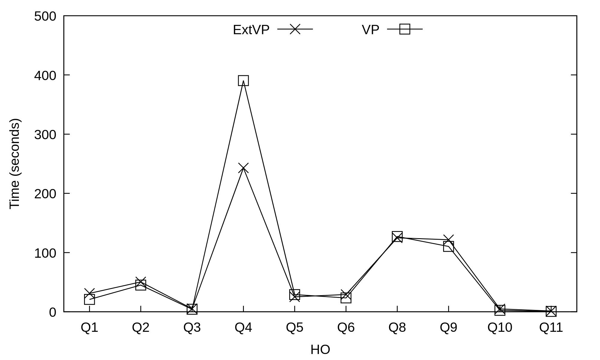

* ORC-Subject-based Partitioning

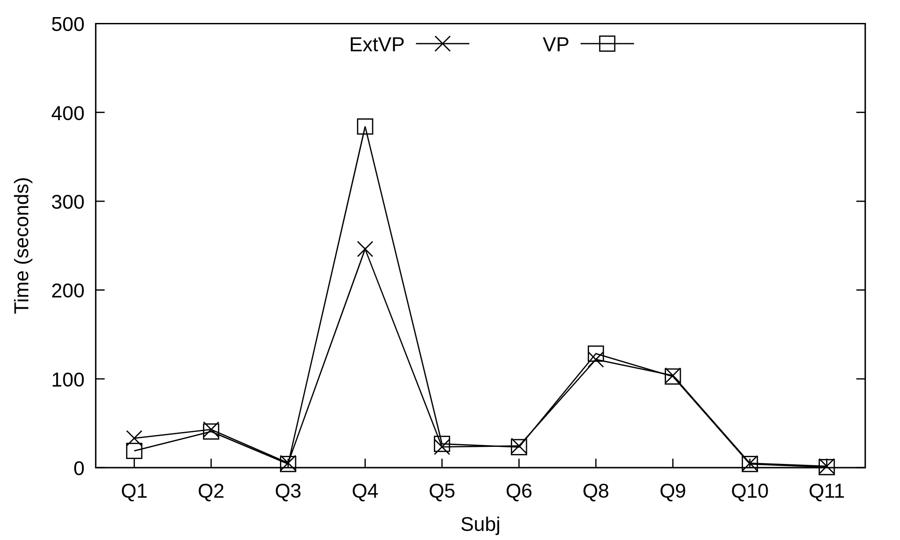

* ORC-Predicate-based Partitioning

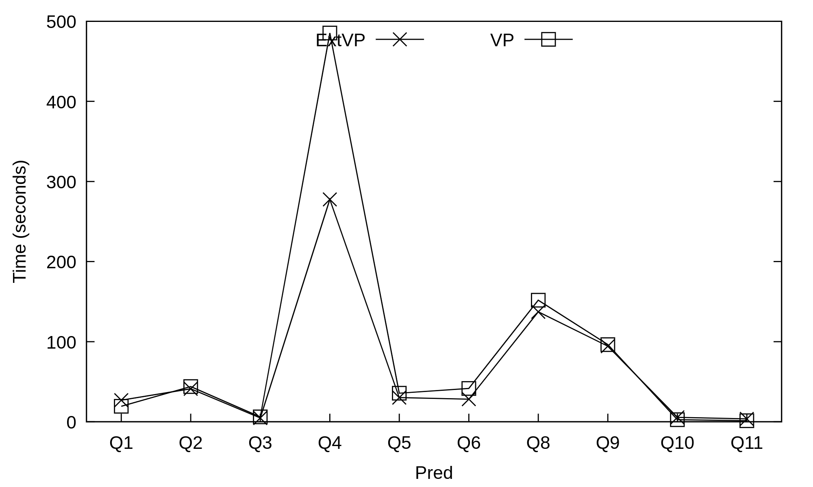

* Parquet-Horizontal Partitioning

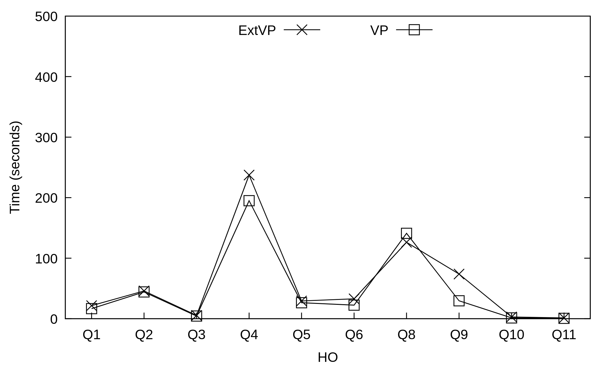

* Parquet-Subject-based Partitioning

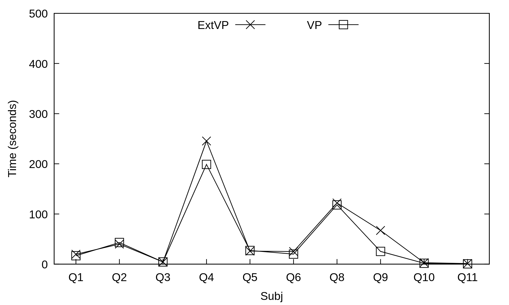

* Parquet-Predicate-based Partitioning

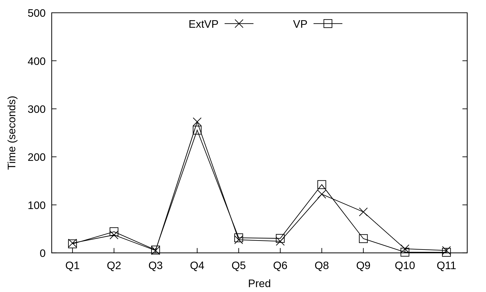

